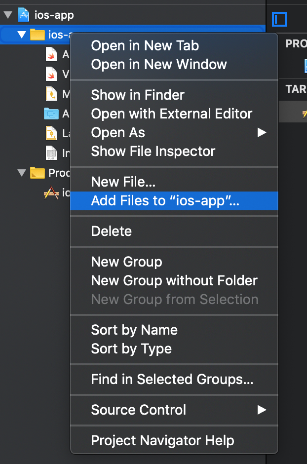
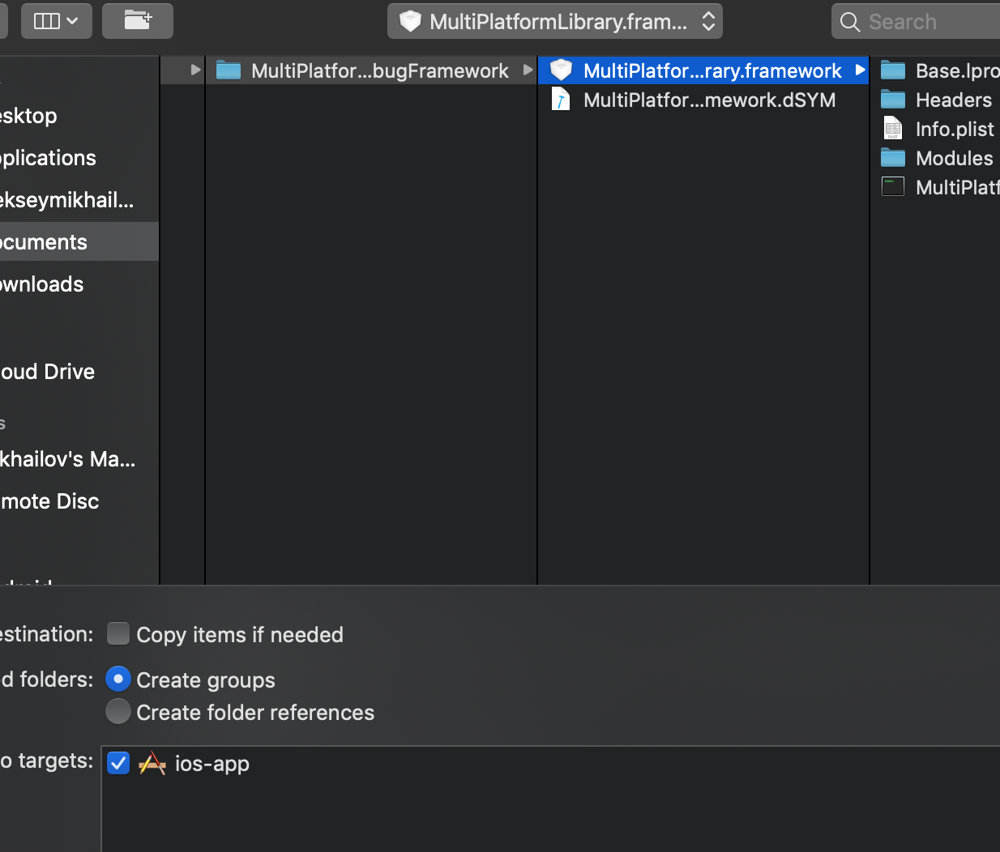
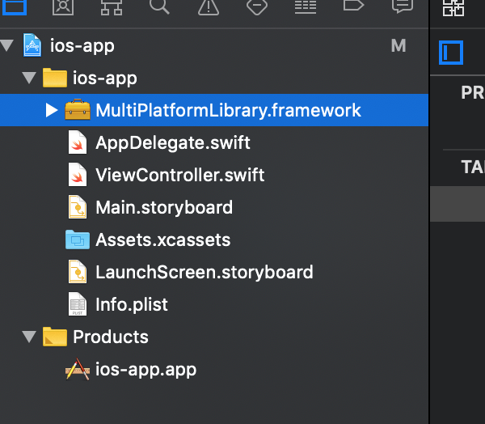
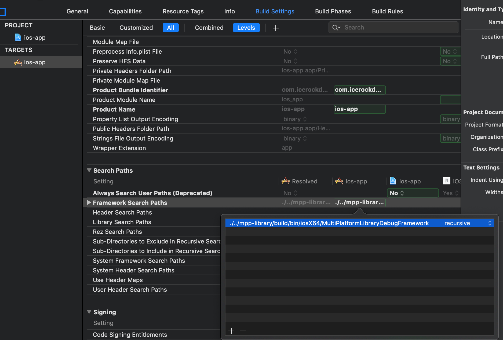

summary: Создание multiplatform модуля для нативных Android, iOS приложений
id: kmp-mobile-from-zero
categories: multiplatform
environments: kotlin-mobile-mpp
status: published
Feedback Link: https://t.me/kotlinmppchats
Analytics Account: UA-81805223-5
Author: Aleksey Mikhailov <am@icerock.dev>

# Добавление к существующим Android, iOS проектам общей библиотеки
## Вводная
Duration: 5

В этом уроке мы сделаем из двух стандартных android и ios проектов мультиплатформенный проект с общей библиотекой на Kotlin Multiplatform. 

Для работы потребуется:
- Android Studio 3.4.0+;
- Xcode 10.3+;
- Xcode Command Line Tools (`xcode-select --install`);
- [CocoaPods](https://cocoapods.org/) (`sudo gem install cocoapods`).

Для начала потребуются 2 проекта - Android и iOS созданные из шаблонов Android Studio и Xcode. Проекты нужно расположить в одну директорию, чтобы получилось так:
```bash
├── android-app
│   ├── build.gradle
│   ├── proguard-rules.pro
│   └── src
│       ├── androidTest
│       │   └── java
│       │       └── com
│       │           └── icerockdev
│       │               └── android_app
│       │                   └── ExampleInstrumentedTest.kt
│       ├── main
│       │   ├── AndroidManifest.xml
│       │   ├── java
│       │   │   └── com
│       │   │       └── icerockdev
│       │   │           └── android_app
│       │   │               └── MainActivity.kt
│       │   └── res
│       │       ├── drawable
│       │       │   └── ic_launcher_background.xml
│       │       ├── drawable-v24
│       │       │   └── ic_launcher_foreground.xml
│       │       ├── layout
│       │       │   └── activity_main.xml
│       │       ├── mipmap-anydpi-v26
│       │       │   ├── ic_launcher.xml
│       │       │   └── ic_launcher_round.xml
│       │       ├── mipmap-hdpi
│       │       │   ├── ic_launcher.png
│       │       │   └── ic_launcher_round.png
│       │       ├── mipmap-mdpi
│       │       │   ├── ic_launcher.png
│       │       │   └── ic_launcher_round.png
│       │       ├── mipmap-xhdpi
│       │       │   ├── ic_launcher.png
│       │       │   └── ic_launcher_round.png
│       │       ├── mipmap-xxhdpi
│       │       │   ├── ic_launcher.png
│       │       │   └── ic_launcher_round.png
│       │       ├── mipmap-xxxhdpi
│       │       │   ├── ic_launcher.png
│       │       │   └── ic_launcher_round.png
│       │       └── values
│       │           ├── colors.xml
│       │           ├── strings.xml
│       │           └── styles.xml
│       └── test
│           └── java
│               └── com
│                   └── icerockdev
│                       └── android_app
│                           └── ExampleUnitTest.kt
├── build.gradle
├── gradle
│   └── wrapper
│       ├── gradle-wrapper.jar
│       └── gradle-wrapper.properties
├── gradle.properties
├── gradlew
├── gradlew.bat
├── ios-app
│   ├── ios-app
│   │   ├── AppDelegate.swift
│   │   ├── Assets.xcassets
│   │   │   ├── AppIcon.appiconset
│   │   │   │   └── Contents.json
│   │   │   └── Contents.json
│   │   ├── Base.lproj
│   │   │   ├── LaunchScreen.storyboard
│   │   │   └── Main.storyboard
│   │   ├── Info.plist
│   │   └── ViewController.swift
│   └── ios-app.xcodeproj
│       ├── project.pbxproj
│       └── project.xcworkspace
│           └── contents.xcworkspacedata
└── settings.gradle
```
Для этого создаем Android проект, после чего модуль `app` переименуем в `android-app` (не забывая изменить имя модуля в `settings.gradle`) и создаем iOS проект `ios-app` в корень android проекта.

Для удобства можно просто скачать начальное состояние [архивом](https://github.com/icerockdev/mobile-multiplatform-education/releases/tag/lesson-1-start).

## Создание модуля общей библиотеки
Duration: 15

Для добавления общей библиотеки нужно добавить новый gradle модуль (android и mpp библиотеки управляются системой сборки [gradle](https://gradle.org/)). Для создания модуля нужно:  
Создаем директорию `mpp-library` (так будет называться наш gradle модуль) рядом с приложениями, чтобы получилось:
```bash
├── android-app
├── ios-app
└── mpp-library
```
Создаем `mpp-library/build.gradle` в нем будет располагаться конфигурация мультиплатформенного модуля. Содержимое файла для начала будет:
```groovy
apply plugin: 'com.android.library'
apply plugin: 'org.jetbrains.kotlin.multiplatform'
```
В `settings.gradle` добавляем подключение нового модуля:
```groovy
include ':mpp-library'
```
[git changes](https://github.com/icerockdev/mobile-multiplatform-education/commit/10b28e5f668f406ed4c4eb28f4240a14a01d8c58)

После сделанных изменений можно запустить `Gradle Sync` и убедиться что модуль подключился, но не может сконфигурироваться, так как для Android библиотеки не хватает данных. Во первых не указаны версии Android SDK. Проставим их:  
В `mpp-library/build.gradle`:
```groovy
android {
    compileSdkVersion 28

    defaultConfig {
        minSdkVersion 21
        targetSdkVersion 28
    }
}
```
[git changes](https://github.com/icerockdev/mobile-multiplatform-education/commit/b3ef95a5335548fb0b5d20f8a7f8bb6ac3bd4bb1)

Теперь `Gradle Sync` будет сообщать о ошибке чтения `AndroidManifest` - этот файл должен присутствовать в любом Android модуле.
Создаем `mpp-library/src/main/AndroidManifest.xml` с содержимым:
```xml
<?xml version="1.0" encoding="utf-8"?>
<manifest package="com.icerockdev.library" /> 
```
[git changes](https://github.com/icerockdev/mobile-multiplatform-education/commit/638b2cbc5cad2cfc10a53a72ec4b7d94c701aa15)

После сделанных действий `Gradle Sync` успешно выполнится.

### Настройка мобильных таргетов
Добавляем в `mpp-library/build.gradle`:
```groovy
kotlin {
    targets {
        android()
        iosArm64()
        iosX64()
    }
}
```
[git changes](https://github.com/icerockdev/mobile-multiplatform-education/commit/2cd19fe01677f4b47fadcab8e99a701643b13273)

Создаем директории:
- `mpp-library/src/commonMain/kotlin/`
- `mpp-library/src/androidMain/kotlin/`
- `mpp-library/src/iosMain/kotlin/`

[git changes](https://github.com/icerockdev/mobile-multiplatform-education/commit/7ea6d9b919dacf64ef16ebbe4ac48c9f51da8b5a)

После этого можем выполнить `Gradle Sync` и увидим что директории `commonMain/kotlin` и `androidMain/kotlin` посветились как директории с исходным кодом. Но `iosMain/kotlin` не подсветился так, к этому вернемся чуть дальше. Сначала сделаем чтобы все относящееся к Android находилось в `androidMain`.

### Конфигурирование Android таргета
Переносим `AndroidManifest.xml` в `androidMain`:
`mpp-library/src/main/AndroidManifest.xml` → `mpp-library/src/androidMain/AndroidManifest.xml`  
[git changes](https://github.com/icerockdev/mobile-multiplatform-education/commit/67cf5b1a3743f1701f5a1c6577bacdb24d8f625b)

Но после переноса можно увидеть что `Gradle Sync` опять не находит `AndroidManifest`. Это связано с тем что Android gradle plugin ничего не знает про kotlin multiplatform плагин. Чтобы корректно перенести все связанное с Android в `androidMain` требуется добавить специальную конфигурацию.

Добавляем в `mpp-library/build.gradle`:
```groovy
android {
    //...

    sourceSets {
        main {
            setRoot('src/androidMain')
        }
        release {
            setRoot('src/androidMainRelease')
        }
        debug {
            setRoot('src/androidMainDebug')
        }
        test {
            setRoot('src/androidUnitTest')
        }
        testRelease {
            setRoot('src/androidUnitTestRelease')
        }
        testDebug {
            setRoot('src/androidUnitTestDebug')
        }
    }
}
```
[git changes](https://github.com/icerockdev/mobile-multiplatform-education/commit/24949ced80a8905e7bcfd2cee4c8b0617aaa519f)

Теперь `Gradle Sync` успешно выполняется.

## Пишем common код
Duration: 5

Создаем `mpp-library/src/commonMain/kotlin/HelloWorld.kt` с содержимым:
```kotlin
object HelloWorld {
    fun print() {
        println("hello common world")
    }
}
```
[git changes](https://github.com/icerockdev/mobile-multiplatform-education/commit/9b174df4fb66d9448d5ebd29930c027ea7f29b09)

Но IDE сообщит что Kotlin не сконфигурирован. Это связано с тем, что для общего кода нужно еще подключить kotlin stdlib.  
В `mpp-library/build.gradle`:
```groovy
kotlin {
    // ...

    sourceSets {
        commonMain {
            dependencies {
                implementation "org.jetbrains.kotlin:kotlin-stdlib:$kotlin_version"
            }
        }
    }
}
```
[git changes](https://github.com/icerockdev/mobile-multiplatform-education/commit/748ed37ffe9b9f29ff992b609fe87f4b803ad746)

Теперь IDE корректно распознает kotlin код и мы можем писать common код на чистом kotlin.

## Реализация примера в Android приложении
Duration: 15

Сначала нужно подключить к `android-app` нашу общую библиотеку. Это делается так как и с любым другим kotlin/java модулем.  
Добавляем в `android-app/build.gradle`:
```groovy
dependencies {
    // ...

    implementation project(":mpp-library")
}
```

Далее вызовем нашу функцию `print` на главном экране.  
Добавляем в `android-app/src/main/java/com/icerockdev/android_app/MainActivity.kt`:
```kotlin
class MainActivity : AppCompatActivity() {
    override fun onCreate(savedInstanceState: Bundle?) {	
        // ...

        HelloWorld.print()
    }
}
```
[git changes](https://github.com/icerockdev/mobile-multiplatform-education/commit/0d23cb4c657a097803f285bd4806df9247b0ab94)

Далее при `Gradle Sync` IDE сообщит что версия sdk в `android-app` ниже чем версия sdk в `mpp-library` - поднимем ее, чтобы мы могли подключить общую библиотеку (либо нужно понизить в общей библиотеке).  
Изменяем в `android-app/build.gradle` минимальную версию androidSdk для совместимости с `mpp-library`:
```groovy
android {
    // ...
    minSdkVersion 21
    // ...
}
```
[git changes](https://github.com/icerockdev/mobile-multiplatform-education/commit/44813bfff5fb00badb0b77a1805e89fbcee6681c)

После этого можем запустить `android-app` на эмуляторе и убедиться что в консоль (logcat) вывелось сообщение.

### Добавляем Android specific код
Предположим что мы хотим использовать какой-то platform-specific api. Для этого мы можем добавить в общей библиотеке код для платформы.  
Создаем `mpp-library/src/androidMain/kotlin/AndroidHelloWorld.kt` с содержимым:
```kotlin
import android.util.Log

object AndroidHelloWorld {
    fun print() {
        Log.v("MPP", "hello android world")
    }
}
```

Это позволит нам в Android версии общей библиотеки видеть еще один класс - `AndroidHelloWorld` и внутри платформенного кода мы можем использовать любой функционал платформы (в нашем случае использовали `android.util.Log`). Остается вызвать и эту функцию в приложении.

Добавляем в `android-app/src/main/java/com/icerockdev/android_app/MainActivity.kt`:
```kotlin
class MainActivity : AppCompatActivity() {
    override fun onCreate(savedInstanceState: Bundle?) {	
        // ...

        AndroidHelloWorld.print()
    }
}
```
[git changes](https://github.com/icerockdev/mobile-multiplatform-education/commit/5f52ed8e241d960bd27c70a7880ab9f544ececc1)

После изменения можно запустить `android-app` чтобы убедиться что работает и логирование через `println` и через андроидный `Log`. 

## Реализация примера в iOS приложении
Ранее мы увидели что `iosMain/kotlin` не распознается IDE как директория с исходным кодом. Это связано с тем, что у нас инициализированы два таргета - `iosArm64` и `iosX64`. Исходный код этих таргетов ожидается в `iosArm64/kotlin` и `iosX64/kotlin` соответственно. Из-за этого выбор либо дублировать код, либо использовать какой либо вариант обобщения. Рекомендуемый нами вариант - использовать symlink'и на `iosMain`. Это позволит не дублировать исходный код и иметь корректную во всех отношениях интеграцию IDE.

Создаем symlink'и `mpp-library/src/iosArm64Main` и `mpp-library/src/iosX64Main`, для этого делаем:
```bash
cd mpp-library/src
ln -s iosMain iosArm64Main
ln -s iosMain iosX64Main
```

[git changes](https://github.com/icerockdev/mobile-multiplatform-education/commit/58f5caa489700bcf2a4bdbaab5723f420f00d275)

После этого можем запустить `Gradle Sync` и увидеть что `iosX64Main/kotlin` и `iosArm64/kotlin` являются директориями с исходным кодом.

Теперь добавим ios-specific код для iOS, с использованием платформенного API. Для этого мы можем создать файл в IDE через любую из наших директорий-symlink'ов (`iosX64Main`,`iosArm64Main`) - они все равно ведут в одно и то же место.

Создаем `mpp-library/src/iosMain/kotlin/IosHelloWorld.kt`:
```kotlin
import platform.Foundation.NSLog

object IosHelloWorld {
    fun print() {
        NSLog("hello ios world")
    }
}
```
[git changes](https://github.com/icerockdev/mobile-multiplatform-education/commit/43504c8598d4ccbf9ddd530e818e8c2481167986)

Можно увидеть что IDE корректно распознает платформенные API ios, имеет автоимпорт, автокомплит и навигацию к определению.

Теперь нужно собрать `framework` который мы сможем подключить к iOS приложению. Но для компиляции `framework`'а нужно дополнить конфигурацию проекта.

В `mpp-library/build.gradle` заменим `iosArm64()` и `iosX64()` на вызов с блоком конфигурации:
```groovy
kotlin {
    targets {
        // ...

        def configure = {
            binaries {
                framework("MultiPlatformLibrary")
            }
        }

        iosArm64("iosArm64", configure)
        iosX64("iosX64", configure)
    }
}
```
[git changes](https://github.com/icerockdev/mobile-multiplatform-education/commit/01406cfaf1ea087372cdafdcd29a73f5eff535df)

После этого  можем вызвать `Gradle Task` `:mpp-library:linkMultiPlatformLibraryDebugFrameworkIosX64` для компиляции `framework`'а для симулятора. По итогу мы получим в директории `build/bin/iosX64/MultiPlatformLibraryDebugFramework/` наш скомпилированный `framework`. И его нужно подключить к iOS приложению.

### Интегрируем framework в iOS приложение
Открываем через Xcode `ios-app/ios-app.xcodeproj` и добавляем фреймворк к проекту. Для этого:  
Добавляем сам фреймворк в проект.  



В итоге должны увидеть фреймворк следующим образом:  


После этого нужно добавить его в embed frameworks. После добавления появится дублирование в прилинкованных, нужно удалить один из прилинкованных, чтобы получилось как на скриншоте:  


И последнее - нужно добавить директорию где лежит фреймворк в доступные для поиска (директория `./../mpp-library/build/bin/iosX64/MultiPlatformLibraryDebugFramework`). Это делается через `Build Settings` таргета приложения.  


[git changes](https://github.com/icerockdev/mobile-multiplatform-education/commit/8b4f83e18537d429dd18b2e9421649e34b762d48)

Теперь можем обновить код экрана, добавив следующее в `ios-app/ios-app/ViewController.swift`:
```swift
import UIKit
import MultiPlatformLibrary

class ViewController: UIViewController {
  override func viewDidLoad() {
    // ...

    HelloWorld().print()
    IosHelloWorld().print()
  }
}
```
[git changes](https://github.com/icerockdev/mobile-multiplatform-education/commit/a9ab47904c0c13e9602f4c9f74a391a5efb3d05b)

После этого можем запустить iOS приложение в симуляторе (не на девайсе! у нас собран фреймворк для симулятора, и настройки пока захардкожены для фреймворка симулятора).

При запуске увидим что работают оба способа логирования и они тоже по разному выглядят в результате, как и в случае Android.

## Подключаем общую библиотеку через CocoaPods
Duration: 10

Для более простой и привычной (для iOS разработчика) интеграции общей библиотеки в приложение можно использовать менеджер зависимостей CocoaPods. Он избавит нас от необходимости прописывать множество настроек в проекте и пересборки фреймворка отделно через `Android Studio`.

Принцип интеграции CocoaPods следующий - мы сделаем локальный pod, внутри которого содержится embed framework (как раз скомпилированный из Kotlin) и сам pod будет иметь только один этап сборки - скрипт с вызовом `gradle` задачи на сборку фреймворка.  
Из-за особенности CocoaPods нужно чтобы фреймворк был всегда в одном и том же предсказуемом месте, у себя в конфигурации мы этим местом сделаем `build/cocoapods/framework/MultiPlatformLibrary.framework`.

### Настраиваем компиляцию framework в единую директорию
В `mpp-library/build.gradle` добавляем:
В начале файла:
```groovy
import org.jetbrains.kotlin.gradle.plugin.mpp.Framework
import org.jetbrains.kotlin.gradle.tasks.KotlinNativeLink
```
В конце файла:
```groovy
tasks.toList().forEach { task ->
    if(!(task instanceof KotlinNativeLink)) return
    def framework = task.binary
    if(!(framework instanceof Framework)) return
    def linkTask = framework.linkTask

    def syncTaskName = linkTask.name.replaceFirst("link", "sync")
    def syncFramework = tasks.create(syncTaskName, Sync.class) {
        group = "cocoapods"

        from(framework.outputDirectory)
        into(file("build/cocoapods/framework"))
    }
    syncFramework.dependsOn(linkTask)
} 
```

### Настраиваем local CocoaPod содержащий наш Framework
Создаем `mpp-library/MultiPlatformLibrary.podspec`:
```ruby
Pod::Spec.new do |spec|
    spec.name                     = 'MultiPlatformLibrary'
    spec.version                  = '0.1.0'
    spec.homepage                 = 'Link to a Kotlin/Native module homepage'
    spec.source                   = { :git => "Not Published", :tag => "Cocoapods/#{spec.name}/#{spec.version}" }
    spec.authors                  = 'IceRock Development'
    spec.license                  = ''
    spec.summary                  = 'Shared code between iOS and Android'

    spec.vendored_frameworks      = "build/cocoapods/framework/#{spec.name}.framework"
    spec.libraries                = "c++"
    spec.module_name              = "#{spec.name}_umbrella"

    spec.pod_target_xcconfig = {
        'MPP_LIBRARY_NAME' => 'MultiPlatformLibrary',
        'GRADLE_TASK[sdk=iphonesimulator*][config=*ebug]' => 'syncMultiPlatformLibraryDebugFrameworkIosX64',
        'GRADLE_TASK[sdk=iphonesimulator*][config=*elease]' => 'syncMultiPlatformLibraryReleaseFrameworkIosX64',
        'GRADLE_TASK[sdk=iphoneos*][config=*ebug]' => 'syncMultiPlatformLibraryDebugFrameworkIosArm64',
        'GRADLE_TASK[sdk=iphoneos*][config=*elease]' => 'syncMultiPlatformLibraryReleaseFrameworkIosArm64'
    }

    spec.script_phases = [
        {
            :name => 'Compile Kotlin/Native',
            :execution_position => :before_compile,
            :shell_path => '/bin/sh',
            :script => <<-SCRIPT
MPP_PROJECT_ROOT="$SRCROOT/../../mpp-library"

"$MPP_PROJECT_ROOT/../gradlew" -p "$MPP_PROJECT_ROOT" "$GRADLE_TASK"
            SCRIPT
        }
    ]
end
```

### Подключаем наш local CocoaPod к проекту
Создаем `ios-app/Podfile`:
```ruby
# ignore all warnings from all pods
inhibit_all_warnings!

use_frameworks!
platform :ios, '11.0'

# workaround for https://github.com/CocoaPods/CocoaPods/issues/8073
# нужно чтобы кеш development pods корректно инвалидировался
install! 'cocoapods', :disable_input_output_paths => true

target 'ios-app' do
  # MultiPlatformLibrary
  # для корректной установки фреймворка нужно сначала скомпилировать котлин библиотеку
  pod 'MultiPlatformLibrary', :path => '../mpp-library'
end
```

В настройках проекта убираем ранее прописанную настройку `FRAMEWORK_SEARCH_PATHS` (для этого надо нажать `backspace` чтобы значение было удалено, а не редактировать значение оставив пустую строку).  


Вызываем `pod install` в директории `ios-app` (заранее нужно установить [cocoapods](https://cocoapods.org)).

[git changes](https://github.com/icerockdev/mobile-multiplatform-education/commit/1d6150d9b4ba98743fb0252ad9e40aee00141d1b)

После успешного `pod install` у нас получается прямая интеграция Xcode с фреймворком (включая автоматическую пересборку фреймворка при пересборке Xcode проекта). После установки pod'ов следует закрыть текущий Xcode проект и открыть теперь `ios-app/ios-app.xcworkspace`. 

После этого можем запускать iOS приложение и увидеть что все работает.

(!) Возможно что при сборке через Xcode `gradle` не сможет выполниться сообщив что отсутствует `java`. В таком случае нужно установить [java development kit](https://www.oracle.com/technetwork/java/javase/downloads/jdk8-downloads-2133151.html). При запуске `gradle` через `Android Studio` используется встроенный в дистрибутив `Android Studio` вариант openjdk, поэтому там все работает из коробки.
