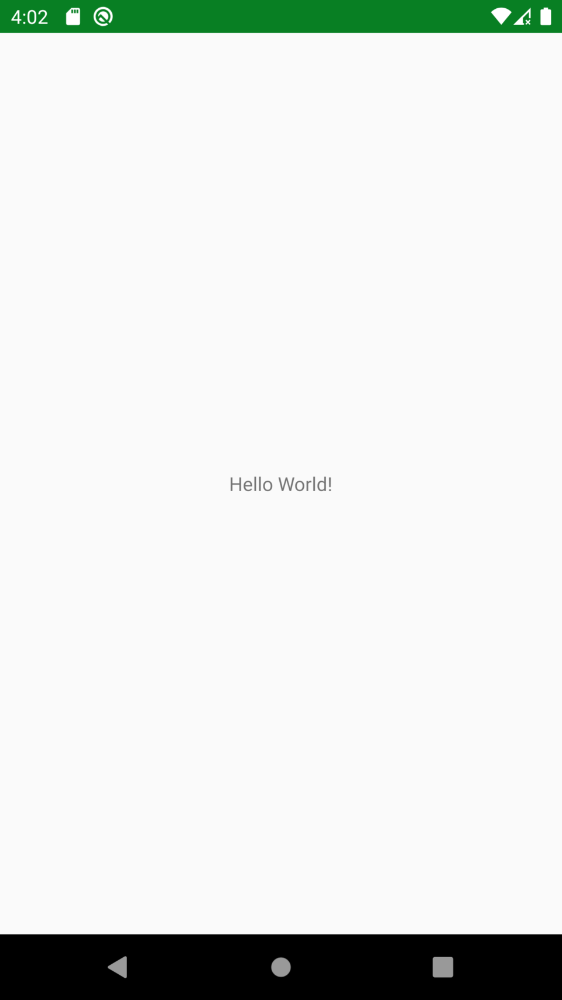

summary: MOKO Widgets #1 - hello world
id: moko-widgets-1
categories: moko
environments: kotlin-mobile-mpp
status: published
Feedback Link: https://github.com/icerockdev/kmp-codelabs/issues
Analytics Account: UA-81805223-5
Author: Aleksey Mikhailov <am@icerock.dev>

# MOKO Widgets #1 - hello world
## Вводная
Duration: 2

В этом уроке будет сделано небольшое приложение полностью из общего кода, используя [moko-widgets](https://github.com/icerockdev/moko-widgets/).

Для работы потребуется:
- Android Studio 3.4.0+;
- Xcode 10.3+;
- Xcode Command Line Tools (`xcode-select --install`);

## Готовим свой проект
Duration: 10

Для начала создадим новый проект на основе шаблона [moko-widgets-template](https://github.com/icerockdev/moko-widgets-template). Для этого на странице шаблона нужно нажать "Use this template", ввести данные своего нового репозитория (например можно назвать `moko-widgets-education`). 

Далее нужно склонировать проект себе локально.

Далее убедимся что проект корректно компилируется. 
- Android - открываем Android Studio и после завершения gradle sync запускаем приложение (Run);
- iOS - вызываем `pod install` в дирректории `ios-app`, а после завершения открываем `ios-app.xcworkspace` и жмем Run.

При запуске приложения мы должны увидеть надпись `Hello world` по центру экрана.

|android app|ios app|
|---|---|
|||

## Знакомимся с начальным кодом
Duration: 5

### Common

`mpp-library/src/commonMain/kotlin/org/example/mpp/App.kt`:
```kotlin
class App : BaseApplication() {
    override fun setup(): ScreenDesc<Args.Empty> {
        val theme = Theme()

        return registerScreen(MainScreen::class) {
            MainScreen(theme)
        }
    }
}
```
Главный класс приложения - `App`, находится в общем коде и является точкой инициализации приложения на обеих платформах. В методе `setup` должна производиться регистрация всех экранов приложения (метод `registerScreen`) и в результате выполнения метода должен быть возвращен стартовый экран (с которого будет запускаться приложение). Тип `Args.Empty` означает, что стартовый экран должен быть без входящих данных (для его открытия ничего передавать не надо).

`mpp-library/src/commonMain/kotlin/org/example/mpp/MainScreen.kt`:
```kotlin
class MainScreen(
    private val theme: Theme
) : WidgetScreen<Args.Empty>() {
    override fun createContentWidget() = with(theme) {
        container(size = WidgetSize.AsParent) {
            center {
                text(
                    size = WidgetSize.WrapContent,
                    text = const(MR.strings.hello_world.desc() as StringDesc)
                )
            }
        }
    }
}
```
Пример экрана с надписью по середине.

### Android

`android-app/src/main/java/org/example/app/MainApplication.kt`:
```kotlin
class MainApplication : Application() {
    override fun onCreate() {
        super.onCreate()

        mppApplication = App().apply {
            setup()
        }
    }

    companion object {
        lateinit var mppApplication: App
    }
}
```
Главный класс Android приложения, инициализирует MPP приложение вызовом `setup`.

`android-app/src/main/java/org/example/app/MainActivity.kt`:
```kotlin
class MainActivity : HostActivity() {
    override val application: BaseApplication
        get() {
            return MainApplication.mppApplication
        }
}
```
Главный (и единственный) экран Android приложения, внутри себя `HostActivity` создает фрагмент из `rootScreen` от MPP приложения и добавляет как контент. 
Чтобы каждый `Screen` мог иметь конструктор у `HostActivity` назначается `fragmentFactory`, которая использует для создания фрагментов данные указанные при регистрации экранов в MPP приложении.

### iOS

`ios-app/src/AppDelegate.swift`:
```swift
@UIApplicationMain
class AppDelegate: NSObject, UIApplicationDelegate {
    
    var window: UIWindow?
    
    func application(_ application: UIApplication, didFinishLaunchingWithOptions launchOptions: [UIApplication.LaunchOptionsKey: Any]? = nil) -> Bool {
        let app = App()
        app.setup()

        let screen = app.rootScreen.instantiate()
        let rootViewController = screen.viewController

        window = UIWindow(frame: UIScreen.main.bounds)
        window?.rootViewController = rootViewController
        window?.makeKeyAndVisible()

        return true
    }
}
```
Делегат iOS приложения, инициализирует MPP приложение через вызов `setup` и создает `UIViewController` от стартового экрана MPP приложения.

## Реализуем экран авторизации
Duration: 10

Создадим новый класс `LoginScreen`:
```kotlin
class LoginScreen : WidgetScreen<Args.Empty>() {
    override fun createContentWidget(): Widget<WidgetSize.Const<SizeSpec.AsParent, SizeSpec.AsParent>> {
        TODO("not implemented") //To change body of created functions use File | Settings | File Templates.
    }
}
```
Наследуем класс от `WidgetScreen`, это означает что содержимое экрана будет создаваться виджетами. У экрана указываем generic тип `Args.Empty`, который означает, что для открытия экрана не требуется передачи никаких данных.
Результат функции `createContentWidget`, которую мы должны реализовать, подсказывает что виджет должен быть размеров на весь экран (ширина и высота `AsParent`).

Для создания виджетов нам потребуется экземпляр `Theme`, добавим его передачу в аргумент и создадим корневой виджет - `constraint`, который позволяет свободно располагать внутри него элементы.

Positive
: `Theme` содержит в себе информацию о `ViewFactory`, которые должны быть использованы для разных типов виджетов и имеет функции для создания виджетов (например `constraint`). Если не использовать `Theme`, то придется создавать виджеты передвая `ViewFactory` вручную, что не удобно и уменьшает возможности стилизации.

```kotlin
class LoginScreen(
    private val theme: Theme
) : WidgetScreen<Args.Empty>() {

    override fun createContentWidget() = with(theme) {
        constraint(size = WidgetSize.AsParent) {
            // here will be widgets
            
            constraints { 
                // here will be constraints
            }
        }
    }
}
```
Создавая корневой виджет `constraint` мы указываем его размер, такой, который требует экран - `WidgetSize.AsParent` (по размеру родителя, то есть экрана в данном случае).
Виджет `constraint` конфигурируется блоком, внутри которого можно добавлять дочерние виджеты, а возвращаемый результат должен быть блоком настройки зависимостей (`constraints`) между этими виджетами.

Далее добавим на экран поле ввода имени и кнопку "войти". 
```kotlin
class LoginScreen(
    private val theme: Theme
) : WidgetScreen<Args.Empty>() {

    override fun createContentWidget() = with(theme) {
        constraint(size = WidgetSize.AsParent) {
            val nameInput = +input(
                size = WidgetSize.WidthAsParentHeightWrapContent,
                id = Ids.Name,
                label = const("Name"),
                field = FormField(initialValue = "", validation = liveBlock { null })
            )

            val submitButton = +button(
                size = WidgetSize.WidthAsParentHeightWrapContent,
                content = ButtonWidget.Content.Text(Value.data("Submit".desc()))
            ) {
                println("submit pressed")
            }

            constraints {
                nameInput centerYToCenterY root
                nameInput leftRightToLeftRight root offset 16

                submitButton bottomToBottom root.safeArea offset 16
                submitButton leftRightToLeftRight root offset 16
            }
        }
    }

    object Ids {
        object Name : InputWidget.Id
    }
}
```
В пределах лямбды настройки `constraint` виджета доступен оператор `+`, который используется для добавления виджета в `constraint` и получения объекта, который можно использовать для настройки зависиомстей в блоке `constraints` - `ConstraintItem`.
В блоке `constraints` мы настроили:
- поле ввода имени расположено по центру вертикально и привязано к горизонтальным границам экрана, с отступом в 16 точек (dp на android, points на iOS);
- кнопка расположена снизу, привязанная к Safe Area с отступом в 16 точек и к горизонтальным границам с тем же отступом.

## Тестируем
Duration: 10

Чтобы увидеть в приложении новый экран, нужно сделать чтобы на него происходил переход. Для простоты сделаем что экран авторизации открывается сразу, как стартовый:
```kotlin
class App : BaseApplication() {
    override fun setup(): ScreenDesc<Args.Empty> {
        val theme = Theme()

        return registerScreen(LoginScreen::class) {
            LoginScreen(theme)
        }
    }
}
```
При чем для создания экрана `LoginScreen` требовался инстанс `Theme`. О том как его можно использовать будет в будущих уроках.

Теперь можно запустить приложение и убедиться что экран выглядит так, как ожидалось:

|android app|ios app|
|---|---|
|||