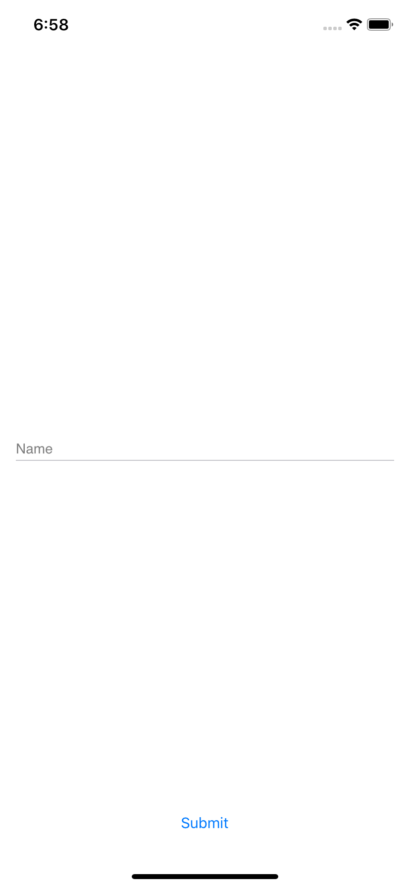
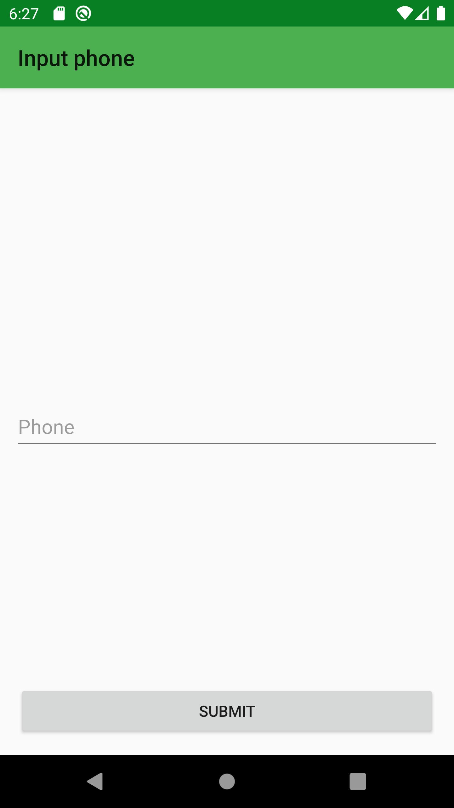
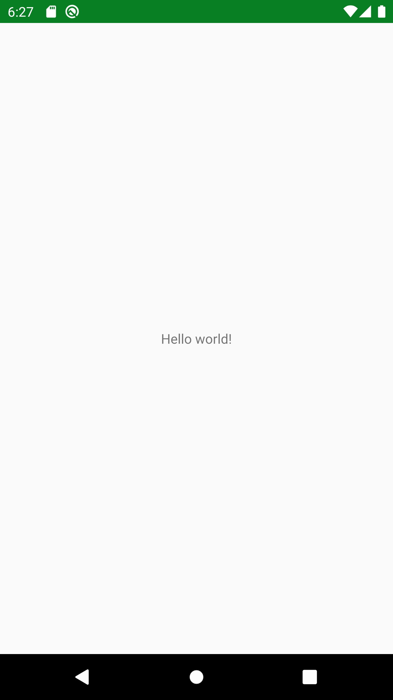
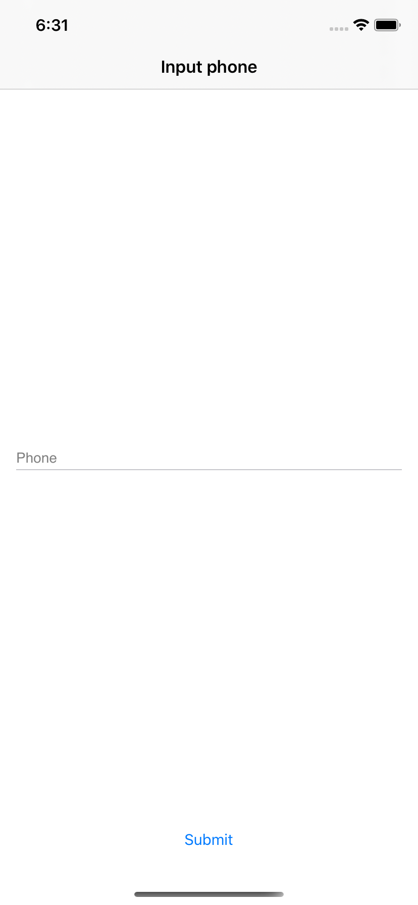
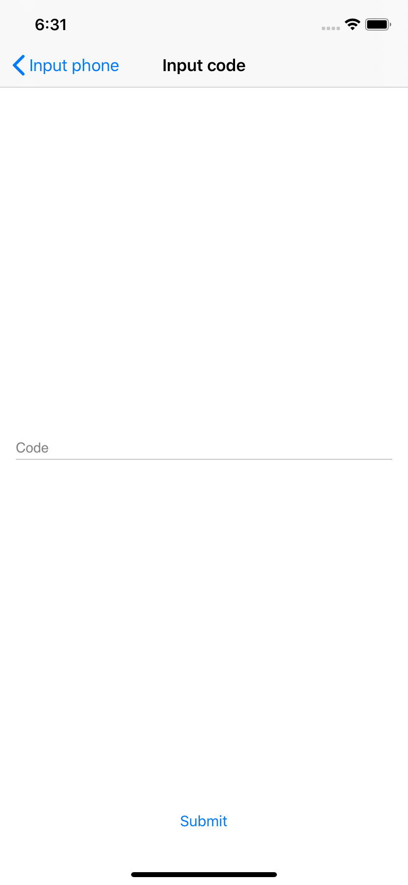

summary: MOKO Widgets #2 - роутинг
id: moko-widgets-2
categories: moko
environments: kotlin-mobile-mpp
status: published
Feedback Link: https://github.com/icerockdev/kmp-codelabs/issues
Analytics Account: UA-81805223-5
Author: Aleksey Mikhailov <am@icerock.dev>

# MOKO Widgets #2 - routing
## Вводная
Duration: 5

Урок является продолжением [MOKO Widgets #1 - hello world](https://codelabs.kmp.icerock.dev/codelabs/moko-widgets-1/). Для выполнения данного урока нужно иметь проект, полученный в результате выполнения предыдущего урока.

Результатом прошлого урока был экран входа с полем ввода имени и кнопкой отправки:

|android app|ios app|
|---|---|
|||

На этом уроке мы добавим навигацию между экранами. Схема переходов будет следующая:

Будут разобраны переходы:
- Обычный переход вперед;
- Переход назад;
- Переход вперед с передачей данных;
- Нижняя навигация табами;
- Переход с обработкой возвращаемого результата.

## Обновляем свой проект
Duration: 2

В этом уроке потребуется обновленная версия moko-widgets, поэтому сначала требуется обновиться до версии [0.1.0-dev-7](https://github.com/icerockdev/moko-widgets/releases/tag/release%2F0.1.0-dev-7). 
Изменения, которые нужно сделать можно посмотреть в [коммите](https://github.com/icerockdev/moko-widgets-template/commit/a617b9bfc6e42fa4203253825d7e530fc496a4d2)

## Схема авторизации
Duration: 2

Согласно схеме экранов процесс авторизации состоит из 2 экранов, после чего переход выполняется на главную.


## Авторизация - экран ввода телефона
Duration: 30

Переименуем полученный на прошлом уроке `LoginScreen` в `InputPhoneScreen` и перенесем в пакет `org.example.mpp.auth` - в нем соберем все классы относящиеся к авторизации, при чем сделаем это так, чтобы никаких внешних зависимостей у классов лежащих в этом пакете не было. Это позволит вынести эти классы в отдельный gradle модуль (разделение по фичам).

### Реализация ViewModel
Далее реализуем обработку действий пользователя, для этого заведем `InputPhoneViewModel`, в которой будет `phoneField` (ранее мы просто создавали инстанс поля не запоминая ссылку на него. Этот объект требуется для `input` виджета). 

```kotlin
class InputPhoneViewModel() : ViewModel() {

    val phoneField: FormField<String, StringDesc> = FormField(
        initialValue = "",
        validation = liveBlock { null }
    )

    fun onSubmitPressed() {
        val phone = phoneField.data.value
        println("phone: $phone")
    }
}
```
Описанная выше `ViewModel` содержит в себе поле ввода телефона, с выключенной валидацией (блок `liveBlock { null}` означает ошибки всегда нет), а так же обработчик нажатия `onSubmitPressed`, который выведет введенный телефон в лог.

### Привязка Screen к ViewModel
Теперь нужно привязать экран к `InputPhoneViewModel`.

Positive
: `ViewModel` переживает смену конфигурации на android. Это означает что если пользователь повернет экран или сменит язык в системе или включит разделение экрана, то данные, которые хранятся в `ViewModel`, а так же и все действия которые она выполняет, останутся доступны и новый пересозданный системой экран подключится к старой вьюмодели, без потерь данных. Чтобы эта логика работала нужно использовать функции получения `ViewModel` у `Screen`: `getViewModel {}` где в лямбде указывается как создать новую вьюмодель, если старой еще нет.

```kotlin
class InputPhoneScreen(
    ...
    private val viewModelFactory: () -> InputPhoneViewModel
) : ... {

    override fun createContentWidget() = with(theme) {
        val viewModel = getViewModel {
            viewModelFactory()
        }

        constraint(size = WidgetSize.AsParent) {
            val nameInput = +input(
                ...
                field = viewModel.phoneField
            )

            val submitButton = +button(
                ...
                onTap = viewModel::onSubmitPressed
            )

            ...
        }
    }
}
```
Из вне в экран передается фабрика `InputPhoneViewModel` через конструктор (внедрение зависимости позволяет ослабить связанность компонентов и реже вносить изменения в код экрана). Далее перед созданием виджетов мы получаем объект `InputPhoneViewModel` вызовом функции `getViewModel` (эта функция либо вернет существующую вьюмодель либо создаст новую). В лямбде `getViewModel` мы указываем как создать новую вьюмодель (в нашем случае вызовом `viewModelFactory`).
После получения `InputPhoneViewModel` мы можем привязать поле ввода к `phoneField` и обработчик нажатия кнопки `viewModel::onSubmitPressed` (таким образом передается функция объекта, чтобы не созадвать новую лямбду).

### Добавление оповещения Screen'а о необходимости перехода
Теперь нам осталось сообщить из `InputPhoneViewModel` что нужно произвести переход на следующий экран. В реальной логике мы выполним запрос к серверу, передав туда телефон, а сервер отдаст нам токен, с которым мы дальше должны работать. Мы сделаем подобие этой логики в вьюмодели.

Positive
: Для связи `ViewModel` -> `Screen` используются либо `LiveData`, которые автоматически подпишутся и отпишутся от получения изменений в нужный момент жизненного цикла либо `EventsDispatcher` (тоже работает учитывая жизненный цикл). Разница в том, что `LiveData` хранит постоянно значения, которые в ней записаны, а `EventsDispatcher` предназначен для разовых оповещенй, например "перейди на следующий экран" или "покажи тост с ошибкой".

```kotlin
class InputPhoneViewModel(
    override val eventsDispatcher: EventsDispatcher<EventsListener>
) : ViewModel(), EventsDispatcherOwner<InputPhoneViewModel.EventsListener> {

    val phoneField: FormField<String, StringDesc> = FormField(
        initialValue = "",
        validation = liveBlock { null }
    )

    fun onSubmitPressed() {
        val token = "token:" + phoneField.data.value
        eventsDispatcher.dispatchEvent { routeInputCode(token) }
    }

    interface EventsListener {
        fun routeInputCode(token: String)
    }
}
```
В `InputPhoneViewModel` мы добавляем внутри интерфейс - `EventsListener`, это интерфейс со всеми событиями, которые может вызвать `ViewModel` у `Screen`'а.
Когда уже есть интерфейс событий, нужно добавить к вьюмодели реализацию интерфейса `EventsDispatcherOwner<InputPhoneViewModel.EventsListener>` и добавить в конструктор `override val eventsDispatcher: EventsDispatcher<EventsListener>` - сам `EventsDispatcher` передается из вне.
Остается вызвать у `eventsDispatcher` метод `dispatchEvent` в нужный момент и указать какой именно метод должен быть вызван у `Screen`'а.

Для эмуляции действий сервера мы сформировали некую строку `token` и передаем ее в вызов `routeInputCode`.

### Реакция Screen'а на оповещения о необходимости перехода
Теперь `ViewModel` имеет дополнительный аргумент в конструкторе, который должен быть передан самим экраном. А так же в `ViewModel` есть `eventsDispatcher`, на который нужно подписаться.

```kotlin
class InputPhoneScreen(
    ...
    private val viewModelFactory: (
        EventsDispatcher<InputPhoneViewModel.EventsListener>
    ) -> InputPhoneViewModel,
    private val routeInputCode: Route<String>
) : ..., InputPhoneViewModel.EventsListener {
    ...

    override fun createContentWidget() = with(theme) {
        val viewModel = getViewModel {
            viewModelFactory(createEventsDispatcher())
        }

        viewModel.eventsDispatcher.listen(this@InputPhoneScreen, this@InputPhoneScreen)

        ...
    }

    ...

    override fun routeInputCode(token: String) {
        routeInputCode.route(this, token)
    }
}
```
В данном коде мы добавили в лямбду фабрики вьюмодели что будет передан `EventsDispatcher`, а так же добавили в конструкторе `InputPhoneScreen` новый аргумент - `routeInputCode`.
`routeInputCode` является типом `Route<String>` и обозначает, что экрану требуется предоставить способ перехода на экран ввода кода, при чем при переходе передаются данные типа `String`.
В получении вьюмодели методом `createEventsDispatcher` мы создаем новый `EventsDispatcher` (это происходит только в момент создания новой вьюмодели, а когда она уже есть создания не будет). После получения новой (или старой) вьюмодели, мы обращаемся к ее `eventsDispatcher` и подписываемся на события методом `listen`. Туда нужно передать сам экран (на его жизненный цикл будет завязана подписка) и объект, который будет слушать события по интерфейсу `InputPhoneViewModel.EventsListener` (в нашем случае это сам экран).
И сам переход выполняется вызовом метода `route` у `routeInputCode` с передачей текущего экрана и данных, которые отправляются (строка с токеном).

### Добавление настроек навигации к экрану
Экран `InputPhoneScreen` будет использоваться в `NavigationScreen` (это экран с `Toolbar`/`UINavigationBar`) и для получения настроек панели навигации `NavigationScreen` требует имплементации интефрейса `NavigationItem` у всех экранов, которые добавляются в `NavigationScreen`. Поэтому нам нужно добавить этот интерфейс и определить требуемые поля.

```kotlin
class InputPhoneScreen(
    ...
) : ..., NavigationItem {

    override val navigationBar: NavigationBar get() = NavigationBar.Normal("Input phone".desc())

    ...
}
```
Интерфейс `NavigationItem` требует добавления свойства `navigationBar`, которое и определяет вид панели навигации (в нашем случае обычная навигация с заголовком "Input phone").

## Авторизация - экран ввода кода
Duration: 20

Экран ввода кода практически идентичен экрану ввода телефона. Имеются следующие отличия:
- Экран ввода кода требует передачи аргумента - `token: String`;
- Переход дальше происходит на главный экран, без передачи каких либо данных;
- Другое название в панели навигации;
- Другое название поля ввода.

### Реализуем ViewModel
```kotlin
class InputCodeViewModel(
    override val eventsDispatcher: EventsDispatcher<EventsListener>,
    private val token: String
) : ViewModel(), EventsDispatcherOwner<InputCodeViewModel.EventsListener> {

    val codeField: FormField<String, StringDesc> = FormField(
        initialValue = token,
        validation = liveBlock { null }
    )

    fun onSubmitPressed() {
        eventsDispatcher.dispatchEvent { routeMain() }
    }

    interface EventsListener {
        fun routeMain()
    }
}
```
В этой вьюмодели добавили аргумент в конструкторе вьюмодели - `token`, который должен передать нам предыдущий экран, а так же изменено имя поля (`codeField`) и роутинг не имеет аругментов (`routeMain`).
Для наглядности выставляем `token` как начальное значение поля `codeField` - так мы увидим что данные успешно переданы.

### Реализуем экран
```kotlin
class InputCodeScreen(
    ...
    private val viewModelFactory: (
        eventsDispatcher: EventsDispatcher<InputCodeViewModel.EventsListener>,
        token: String
    ) -> InputCodeViewModel,
    private val routeMain: Route<Unit>
) : WidgetScreen<Args.Parcel<InputCodeScreen.Arg>>(), InputCodeViewModel.EventsListener, ... {

    override val navigationBar: NavigationBar get() = NavigationBar.Normal("Input code".desc())

    override fun createContentWidget() = with(theme) {
        val viewModel = getViewModel {
            viewModelFactory(createEventsDispatcher(), getArgument().token)
        }

        ...

        constraint(size = WidgetSize.AsParent) {
            val nameInput = +input(
                ...
                label = const("Code"),
                field = viewModel.codeField
            )

            ...
        }
    }

    ...

    override fun routeMain() {
        routeMain.route(this)
    }

    @Parcelize
    data class Arg(val token: String) : Parcelable
}
```
Основные отличия экрана `InputCodeScreen` от `InputPhoneScreen` это наличие аргумента. 

Во первых добавлен класс `Arg`:
```kotlin
@Parcelize
data class Arg(val token: String) : Parcelable
```
это должен быть `Parcelable` класс, чтобы android мог корректно его сохранять и передавать между экранами. 

Negative
: Для работы `Parcelable` надо включить плагин `id("kotlin-android-extensions")` в `mpp-library/build.gradle.kts`

Чтение аргумента происходит при создании вьюмодели, а лямбда `viewModelFactory` расширена аргументом `token`.

Переход `routeMain` имеет тип `Route<Unit>`. `Unit` означает что никаких данных передавать не требуется.

## Авторизация - фабрика фичи
Duration: 10

Для построения DI конкретной фичи (авторизации) добавим в пакете `org.example.mpp.auth` класс `AuthFactory`, которому из-вне потрубуется только `theme: Theme`.
В самом классе объявим функции создания экранов авторизации:
```kotlin
class AuthFactory(
    private val theme: Theme
) {
    fun createInputPhoneScreen(routeInputCode: Route<String>): InputPhoneScreen {
        return InputPhoneScreen(
            theme = theme,
            viewModelFactory = { InputPhoneViewModel(it) },
            routeInputCode = routeInputCode
        )
    }

    fun createInputCodeScreen(routeMain: Route<Unit>): InputCodeScreen {
        return InputCodeScreen(
            theme = theme,
            viewModelFactory = { eventsDispatcher, token ->
                InputCodeViewModel(eventsDispatcher, token)
            },
            routeMain = routeMain
        )
    }
}
```
При создании экранов так же передается из-вне путь до других экранов в навигации. например `routeMain` и `routeInputCode`.

Создадим объект `AuthFactory` в `App` и построим навигацию через `NavigationScreen`:
```kotlin
class App : BaseApplication() {
    override fun setup(): ScreenDesc<Args.Empty> {
        val theme = Theme()

        val authFactory = AuthFactory(theme)

        return registerScreen(RootNavigationScreen::class) {
            val rootNavigationRouter = createRouter()

            val mainScreen = registerScreen(MainScreen::class) {
                MainScreen(theme)
            }

            val inputCodeScreen = registerScreen(InputCodeScreen::class) {
                authFactory.createInputCodeScreen(
                    routeMain = rootNavigationRouter.createReplaceRoute(mainScreen)
                )
            }

            val inputPhoneScreen = registerScreen(InputPhoneScreen::class) {
                authFactory.createInputPhoneScreen(
                    routeInputCode = rootNavigationRouter.createPushRoute(inputCodeScreen) {
                        InputCodeScreen.Arg(it)
                    }
                )
            }

            RootNavigationScreen(
                initialScreen = inputPhoneScreen,
                router = rootNavigationRouter
            )
        }
    }
}

class RootNavigationScreen(
    initialScreen: TypedScreenDesc<Args.Empty, InputPhoneScreen>,
    router: Router
) : NavigationScreen<InputPhoneScreen>(initialScreen, router)
```

Во первых `NavigationScreen` является `abstract` классом и требует наследоваться от него. Это сделанно из-за ограничения android платформы - пересоздание экранов происходит по имени класса в системе, из-за этого для разных экранов с разными входящими параметрами (то что передается в конструктор) должны быть использованы разные классы. По этой причине создан `RootNavigationScreen`, который является стартовым экраном приложения и регулирует всю навигацию приложения.

При регистрации экрана `RootNavigationScreen` в лямбде его создания мы имеем метод `createRouter`, который создает класс [`NavigationScreen.Router`](https://github.com/icerockdev/moko-widgets/blob/51f71df44a98a542ee012e58d996e554c9a1d1ef/widgets/src/commonMain/kotlin/dev/icerock/moko/widgets/screen/navigation/NavigationScreen.kt#L19). Через `Router` мы можем создавать переходы (Push, Replace, Pop).

Далее для `RootNavigationScreen` требуется начальный экран, это у нас `InputPhoneScreen`, который мы зарегистирровали и сразу предаем ему путь до следующего экрана. Создание происходит так:
```kotlin
routeInputCode = rootNavigationRouter.createPushRoute(inputCodeScreen) {
    InputCodeScreen.Arg(it)
}
```
В лямбде происходит преобразование данных, которые передает экран (`InputPhoneScreen`), в данном случае `String`, к данным, которые ожидает экран (`data class InputCodeScreen.Arg`).

Аналогичным способом регистрируется и экран `InputCodeScreen` с переходом на главный экран через `createReplaceRoute`.

## Авторизация - тестируем
Duration: 5

Теперь можно скомпилировать проект и увидеть рабочую навигацию процесса авторизации. 

### Android

|input phone|input code|main|
|---|---|---|
||||

### iOS

|input phone|input code|main|
|---|---|---|
||||

## Главный экран
Duration: 10


