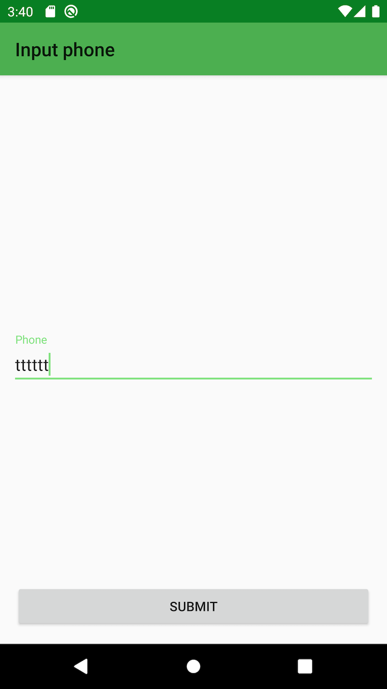
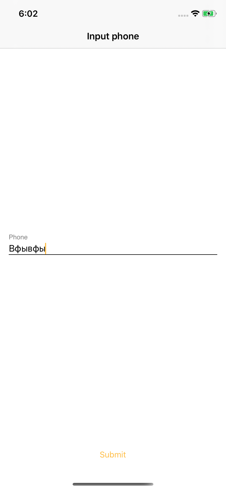
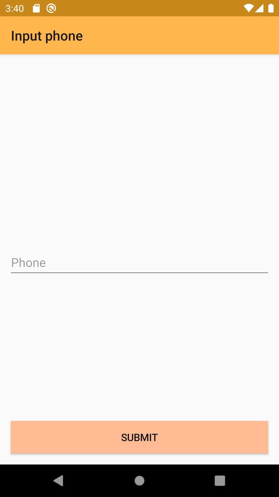
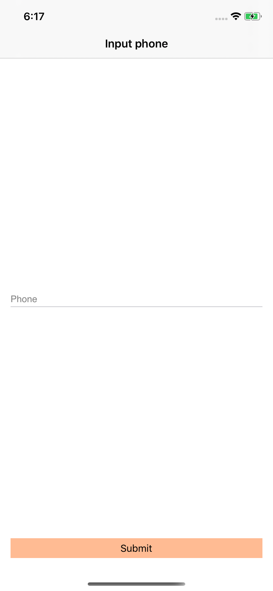

summary: MOKO Widgets #3 - стилизация
id: moko-widgets-3
categories: moko
environments: kotlin-mobile-mpp
status: published
Feedback Link: https://github.com/icerockdev/kmp-codelabs/issues
Analytics Account: UA-81805223-5
Author: Aleksey Mikhailov <am@icerock.dev>

# MOKO Widgets #3 - styles
## Вводная
Duration: 5

Урок является продолжением [MOKO Widgets #2 - routing](https://codelabs.kmp.icerock.dev/codelabs/moko-widgets-2/). Для выполнения данного урока нужно иметь проект, полученный в результате выполнения предыдущего урока.

Результатом прошлого урока было приложение с экранами:
- Ввод телефона;
- Ввод кода;
- Профиль;
- Редактирование профиля;
- Информация.

На этом уроке мы добавим стилизацию экранов. Это включает в себя:
- Изменение tint;
- Изменение стиля всех элементов определенного типа;
- Изменение стиля группы элементов определенного типа;
- Изменение стиля конкретного элемента;
- Стилизация BottomNavigation.

## Настройка платформенных стилей
Duration: 10

В результате предыдущего урока получено приложение, в котором стартовый экран выглядит так:

|android app|ios app|
|---|---|
|||

Теперь изменим цвет статусбара и навбара на Android, а так же акцент цвет на обеих платформах (синий на iOS и ярко зеленый на Android).

### Android
На Android изменения этих цветов выполняются через тему приложения в файле `android-app/src/main/res/values/styles.xml`:
```xml
<?xml version="1.0" encoding="utf-8"?>
<resources>
    <style name="AppTheme" parent="Theme.AppCompat.Light.NoActionBar">
        <!-- your app branding color for the app bar -->
        <item name="colorPrimary">#FF4caf50</item>
        <!-- darker variant for the status bar and contextual app bars -->
        <item name="colorPrimaryDark">#FF087f23</item>
        <!-- theme UI controls like checkboxes and text fields -->
        <item name="colorAccent">#FF80e27e</item>
    </style>
</resources>
```
`collorAccent` отвечает за цвет указателя в тексте, лейбла и подчеркивания по умолчанию и используется в других подобных местах для обращения внимания. Цвет указателя в тексте можно заменить только через данный файл стилей.
`colorPrimaryDark` это цвет статусбара, тоже можно менять только через данный файл.

Сменим цвет на оранжевую тему:
```xml
<?xml version="1.0" encoding="utf-8"?>
<resources>
    <style name="AppTheme" parent="Theme.AppCompat.Light.NoActionBar">
        <!-- your app branding color for the app bar -->
        <item name="colorPrimary">#FFffb74d</item>
        <!-- darker variant for the status bar and contextual app bars -->
        <item name="colorPrimaryDark">#FFc88719</item>
        <!-- theme UI controls like checkboxes and text fields -->
        <item name="colorAccent">#FFffbd45</item>
    </style>
</resources>
```

В результате получим:


### iOS
На iOS можно задать глобальный tint цвет, который выдаст нужный нам результат. 
Для этого в `ios-app/src/AppDelegate.swift` нужно добавить:
```swift
func application(_ application: UIApplication, didFinishLaunchingWithOptions launchOptions: [UIApplication.LaunchOptionsKey: Any]? = nil) -> Bool {
    ...

    window = UIWindow(frame: UIScreen.main.bounds)
    ...
    window?.tintColor = UIColor(red:1.00, green:0.74, blue:0.27, alpha:1.0)
    window?.makeKeyAndVisible()

    return true
}
```

И получим:


## Глобальное применение стилей
Duration: 10

Следующий этап стилизации - оформление всех кнопок в соответствии дизайну. По дизайну требуется чтобы был фон кнопок оранжевого цвета, текст черный с размером шрифта 15.

Для применения данных настроек нам нужно воспользоваться возможностями класса `Theme`. В нашем проекте уже есть создание объекта этого класса и он используется для дальнейшего создания всех виджетов. Сейчас нам нужно задать что в данной теме все кнопки будут создаваться с кастомным стилем.

Оформление по умолчанию устанавливается через категорию `ButtonWidget.DefaultCategory` в `Theme`, его нам и нужно кастомизировать.

Positive
: Если провести аналогию с `CSS`, то `DefaultCategory` это стиль наложенный на все элементы данного типа:
```css
button {
  color: red;
  text-align: center;
} 
```


`mpp-library/src/commonMain/kotlin/org/example/mpp/App.kt`:
```kotlin
class App : BaseApplication() {
    override fun setup(): ScreenDesc<Args.Empty> {
        val theme = Theme()

        ...
    }
}
```
На данный момент объект создается без предедачи каких либо аргументов, но `Theme` может принимать 2 аргумента:
- родительская тема (все настройки родительской темы унаследуются в новую);
- лямбда настройки темы.

Сейчс используем лямбду настройки:  
`mpp-library/src/commonMain/kotlin/org/example/mpp/App.kt`:
```kotlin
val Colors.orange get() = Color(0xff8a65FF)
val Colors.orangeLight get() = Color(0xffbb93FF)
val Colors.orangeDark get() = Color(0xc75b39FF)

class App : BaseApplication() {
    override fun setup(): ScreenDesc<Args.Empty> {
        val theme = Theme() {
            factory[ButtonWidget.DefaultCategory] = SystemButtonViewFactory(
                background = StateBackground(
                    normal = Background(
                        fill = Fill.Solid(color = Colors.orangeLight)
                    ),
                    pressed = Background(
                        fill = Fill.Solid(color = Colors.orange)
                    ),
                    disabled = Background(
                        fill = Fill.Solid(color = Colors.orangeDark)
                    )
                ),
                textStyle = TextStyle(color = Colors.black, size = 15)
            )
        }

        ...
    }
}
```
- Помимо настройки фабрики кнопок мы добавили в стандартный набор цветов свои, путем объявления экстеншен свойств;
- У кнопки фон составной - под 3 состояния кнопки (нормальное, нажатое, выключенное), поэтому под каждое состояние мы передаем настройки фона (используем заливку определенным цветом);
- Для указания стиля текста используем `TextStyle`;
- У всех контейнеров стилизации (`TextStyle`, `Background` и прочие) все аттрибуты не обязательные и по умолчанию имеют значения `null`. При этом значении каждая платформа будет использовать настройку по умолчанию от самой платформы.

В итоге получаем следующий результат:

|android app|ios app|
|---|---|
|||

## Применение стилей к группе элементов
Duration: 10

Оформление группами реализуется через указание элементам отдельной `Category` и применение для этой `Category` своей фабрики в `Theme`.

Positive
: Если провести аналогию с `CSS`, то `Category` это стиль наложенный на class:
```css
.myclass {
  color: red;
  text-align: center;
} 
```


## Применение стилей к отдельному элементу
Duration: 10

Оформление группами реализуется через указание элементам определенного `Id` и применение для этого `Id` своей фабрики в `Theme`.

Positive
: Если провести аналогию с `CSS`, то `Id` это стиль наложенный на id:
```css
#myclass {
  color: red;
  text-align: center;
} 
```


## Применение стилей к нижней навигации
Duration: 10


