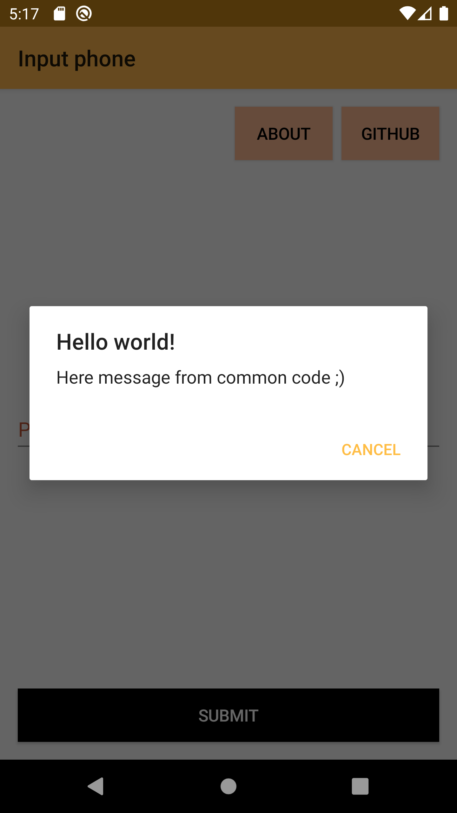
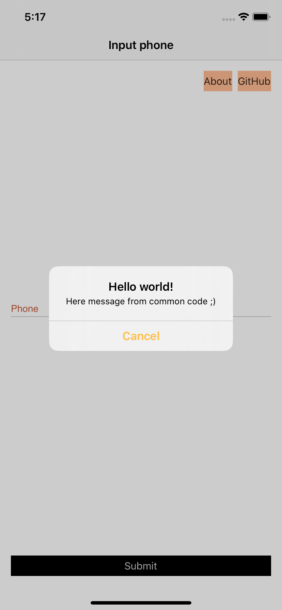

summary: MOKO Widgets #4 - действия на экранах
id: moko-widgets-4
categories: moko
environments: kotlin-mobile-mpp
status: published
Feedback Link: https://github.com/icerockdev/kmp-codelabs/issues
Analytics Account: UA-81805223-5
Author: Aleksey Mikhailov <am@icerock.dev>

# MOKO Widgets #4 - screen actions
## Вводная
Duration: 5

Урок является продолжением [MOKO Widgets #3 - styles](https://codelabs.kmp.icerock.dev/codelabs/moko-widgets-3/). Для выполнения данного урока нужно иметь проект, полученный в результате выполнения предыдущего урока.

Результатом прошлого урока было приложение с навигацией и стилизацией экранов.

На этом уроке мы добавим различные действия, происходящие на экране:
- Открытие ссылки в браузере;
- Показ сообщения;
- Показ диалога с обработкой ответа пользователя;
- Открытие системного экрана с обработкой результата.

## Показать toast
Duration: 5

Предположим что мы хотим при нажатии на кнопку Submit с пустым полем ввода выводить toast (всплывающее сообщение), вместо error label у поля.

### Реализация логики
Добавим проверку на пустоту в `InputPhoneViewModel`.

`mpp-library/src/commonMain/kotlin/org/example/mpp/auth/InputPhoneScreen.kt`:
```kotlin
class InputPhoneViewModel(
    ...
) : ... {
    ...

    fun onSubmitPressed() {
        val phone = phoneField.data.value
        if(phone.isBlank()) {
            eventsDispatcher.dispatchEvent { showError("it's cant be blank!".desc()) }
            return
        }
        val token = "token:$phone"
        eventsDispatcher.dispatchEvent { routeInputCode(token) }
    }

    interface EventsListener {
        fun routeInputCode(token: String)
        fun showError(error: StringDesc)
    }
}
```
Во первых мы добавили новый метод в `EventsListener`, а значит экран должен его поддерживать. А в обработчике нажатия на кнопку проверяем текст на пустоту, если он пустой - вызываем показ ошибки.

### Реализациия экрана
Метод показа `toast` встроен в moko-widgets начиная с релиза [0.1.0-dev-8](https://github.com/icerockdev/moko-widgets/releases/tag/release%2F0.1.0-dev-8).

`mpp-library/src/commonMain/kotlin/org/example/mpp/auth/InputPhoneScreen.kt`:
```kotlin
class InputPhoneScreen(
    ...
) : ... {
    ...

    override fun showError(error: StringDesc) {
        showToast(error)
    }
}
```

### Тестирование
Теперь можно запустить приложение (как Android так и iOS) и убедиться что toast успешно показывается.

## Открытие ссылки
Duration: 15

Для примера добавим на экран ввода телефона кнопку `GitHub`, по нажатию на которую должен открыться гитхаб `moko-widgets`. 

### Добавление кнопки
Чтобы это реализовать сначала добавим кнопку на экран:

`mpp-library/src/commonMain/kotlin/org/example/mpp/auth/InputPhoneScreen.kt`:
```kotlin
class InputPhoneScreen(
    ...
) : ... {
    ...

    override fun createContentWidget() = with(theme) {
        ...

        constraint(size = WidgetSize.AsParent) {
            ...

            val githubButton = +button(
                size = WidgetSize.WrapContent,
                content = ButtonWidget.Content.Text(Value.data("GitHub".desc())),
                onTap = ::onGitHubPressed
            )

            constraints {
                ...

                githubButton centerXToCenterX root
                githubButton topToTop root.safeArea offset 16
            }
        }
    }

    private fun onGitHubPressed() {
        TODO()
    }

    ...
}
```

### Реализация обработчика кнопки
Теперь остается добавить реакцию на нажатие кнопки. Нам нужно открыть url в браузере.
На android для открытия URL нам нужен context (любой экран приложения по сути), а на iOS можем из любого места приложения вызвать нужный код. Чтобы действие было доступно из общего кода реализуем специальную `expect` экстеншен функцию к классу `Screen` (это даст нам  доступ до context на android).

`mpp-library/src/commonMain/kotlin/org/example/mpp/ScreenExt.kt`:
```kotlin
expect fun Screen<*>.openUrl(url: String)
```

Android - `mpp-library/src/androidMain/kotlin/org/example/mpp/ScreenExt.kt`:
```kotlin
actual fun Screen<*>.openUrl(url: String) {
    val context = requireContext()
    val openIntent = Intent(Intent.ACTION_VIEW, Uri.parse(url))
    if (openIntent.resolveActivity(context.packageManager) != null) {
        context.startActivity(openIntent)
    }
}
```

Positive
: так как `Screen` это `Fragment` на android, то `this` в этой функции имеет все возможности `Fragment` - включая и `requireContext()`.

iOS - `mpp-library/src/iosMain/kotlin/org/example/mpp/ScreenExt.kt`:
```kotlin
actual fun Screen<*>.openUrl(url: String) {
    UIApplication.sharedApplication.openURL(NSURL.URLWithString(url)!!)
}
```

Positive
: для добавления `iosMain` в данном шаблоне доступно использование symlinks, подробнее было указано в [codelab](https://codelabs.kmp.icerock.dev/codelabs/kmp-mobile-from-zero/index.html?index=..%2F..index#4).

Остается в обработчике кнопки вызвать наш новый метод:

`mpp-library/src/commonMain/kotlin/org/example/mpp/auth/InputPhoneScreen.kt`:
```kotlin
class InputPhoneScreen(
    ...
) : ... {
    ...

    private fun onGitHubPressed() {
        openUrl("https://github.com/icerockdev/moko-widgets")
    }

    ...
}
```

### Тестирование
Теперь можно запустить приложение (как Android так и iOS) и убедиться что открытие ссылки полностью работает.


## Показ сообщения
Duration: 15

Для примера сделаем кнопку `About`, при нажатии на которую будет открываться диалог с информацией о приложении, с кнопкой `Close`.

### Добавление кнопки
Чтобы это реализовать сначала добавим кнопку на экран:

`mpp-library/src/commonMain/kotlin/org/example/mpp/auth/InputPhoneScreen.kt`:
```kotlin
class InputPhoneScreen(
    ...
) : ... {
    ...

    override fun createContentWidget() = with(theme) {
        ...

        constraint(size = WidgetSize.AsParent) {
            ...

            val aboutButton = +button(
                size = WidgetSize.WrapContent,
                content = ButtonWidget.Content.Text(Value.data("About".desc())),
                onTap = ::onAboutPressed
            )

            constraints {
                ...

                githubButton rightToRight root offset 16 // изменим положение кнопки, чтобы вместить новую кнопку рядом
                githubButton topToTop root.safeArea offset 16

                aboutButton rightToLeft githubButton offset 8
                aboutButton topToTop githubButton
            }
        }
    }

    private fun onAboutPressed() {
        TODO()
    }

    ...
}
```

### Реализация обработчика кнопки
Теперь остается добавить реакцию на нажатие кнопки. Нам нужно открыть [AlertDialog](https://developer.android.com/reference/android/app/AlertDialog.html) на android и [UIAlertController](https://developer.apple.com/documentation/uikit/uialertcontroller) на iOS.
На android нам нужен `Context` (любой экран приложения по сути), а на iOS для отображения нужен `UIViewController`. Чтобы действие было доступно из общего кода реализуем специальную `expect` экстеншен функцию к классу `Screen` (это даст нам  доступ до `Context` на android и до `UIViewController`).

`mpp-library/src/commonMain/kotlin/org/example/mpp/ScreenExt.kt`:
```kotlin
expect fun Screen<*>.showMessage(title: StringDesc, message: StringDesc)
```

Android - `mpp-library/src/androidMain/kotlin/org/example/mpp/ScreenExt.kt`:
```kotlin
actual fun Screen<*>.showMessage(
    title: StringDesc,
    message: StringDesc
) {
    val context = requireContext()
    AlertDialog.Builder(context)
        .setTitle(title.toString(context))
        .setMessage(message.toString(context))
        .setPositiveButton(android.R.string.cancel) { _, _ -> }
        .setCancelable(true)
        .create()
        .show()
}
```

Negative
: В данной реализации сообщение пропадет при смене конфигурации (изменили язык в настройках телефона, или повернули экран или включили разделение экрана). В следующем примере будет разобран вариант с сохранением состояния.

iOS - `mpp-library/src/iosMain/kotlin/org/example/mpp/ScreenExt.kt`:
```kotlin
actual fun Screen<*>.showMessage(
    title: StringDesc,
    message: StringDesc
) {
    val alertController = UIAlertController.alertControllerWithTitle(
        title = title.localized(),
        message = message.localized(),
        preferredStyle = UIAlertControllerStyleAlert
    )
    alertController.addAction(
        UIAlertAction.actionWithTitle(
            title = "Cancel",
            style = UIAlertActionStyleCancel,
            handler = null
        )
    )
    viewController.presentViewController(alertController, animated = true, completion = null)
}
```

Positive
: у `Screen` в iOS доступен метод `viewController` для получения `UIViewController` созданного из `Screen` и выполнения любых операций над ним.

Остается в обработчике кнопки вызвать наш новый метод:

`mpp-library/src/commonMain/kotlin/org/example/mpp/auth/InputPhoneScreen.kt`:
```kotlin
class InputPhoneScreen(
    ...
) : ... {
    ...

    private fun onAboutPressed() {
        showMessage(
            title = "Hello world!".desc(),
            message = "Here message from common code ;)".desc()
        )
    }

    ...
}
```

### Тестирование
Теперь можно запустить приложение (как Android так и iOS) и убедиться что диалог отображается.

|android app|ios app|
|---|---|
|||

## Показ диалога с обработкой результата
Duration: 2

Усложним пример с показом сообщения - теперь нам нужно показать диалог с вопросом "Open github?" при нажатии на кнопку `GitHub`. В диалоге должны быть варианты ответа `Yes` (открывает сайт) и `No` (просто закрывает диалог).

Данная задача осложняется тем, что Android может независимо от работы приложения пересоздавать экран, а значит нужно предусмотреть восстановление диалога и привязку обработчиков нажатий.

Кнопка `GitHub` у нас уже есть, поэтому сразу переходим к реализации обработчика.

Negative
: на данный момент moko-widgets не позволяет корректно привязать кастомный обработчик данных, раздел будет обновлен позже после обновления [moko-widgets#4](https://github.com/icerockdev/moko-widgets/issues/4)

## Открытие системного экрана
Duration: 2

При интеграции нативного функционала типа "выбрать контакт из списка контактов телефона" так же может потребоваться показ экрана с обработкой результата.

android:
```kotlin
Intent(Intent.ACTION_PICK, ContactsContract.Contacts.CONTENT_URI)

startActivityForResult

override fun onActivityResult(requestCode: Int, resultCode: Int, data: Intent?) {
    super.onActivityResult(requestCode, resultCode, data)
    
    if (requestCode == SELECT_CONTACT && resultCode == Activity.RESULT_OK) {
        val contactUri = data?.data ?: return
        val projection = arrayOf(ContactsContract.CommonDataKinds.Phone.DISPLAY_NAME,
                ContactsContract.CommonDataKinds.Phone.NUMBER)
        val cursor = requireContext().contentResolver.query(contactUri, projection,
                null, null, null)

        if (cursor != null && cursor.moveToFirst()) {
            val nameIndex = cursor.getColumnIndex(ContactsContract.CommonDataKinds.Phone.DISPLAY_NAME)
            val numberIndex = cursor.getColumnIndex(ContactsContract.CommonDataKinds.Phone.NUMBER)
            val name = cursor.getString(nameIndex)
            val number = cursor.getString(numberIndex)

            // do something with name and phone
        }
        cursor?.close()
    }
}
```

ios:
```swift
let contactPicker = CNContactPickerViewController()
contactPicker.delegate = self

extension FriendsViewController: CNContactPickerDelegate {
  func contactPicker(_ picker: CNContactPickerViewController,
                     didSelect contacts: [CNContact]) {
    // ...
  }
}
```

Negative
: на данный момент moko-widgets не позволяет корректно привязать кастомный обработчик данных, раздел будет обновлен позже после обновления [moko-widgets#4](https://github.com/icerockdev/moko-widgets/issues/4)
