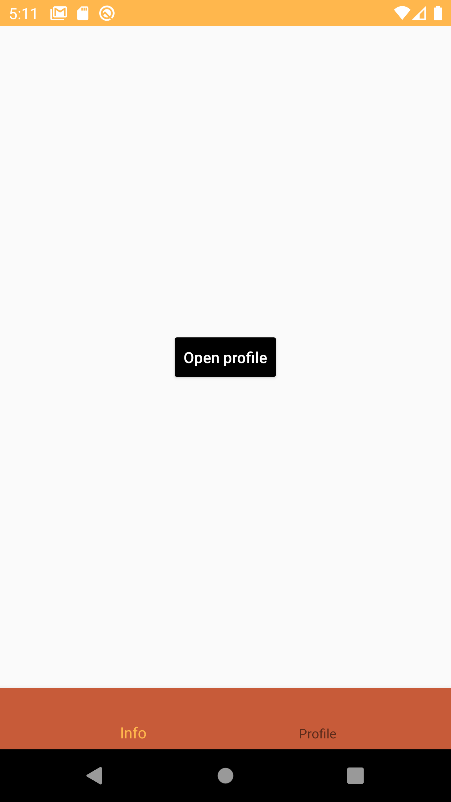

summary: MOKO Widgets #6 - платформенные экраны
id: moko-widgets-6
categories: moko
environments: kotlin-mobile-mpp
status: published
Feedback Link: https://github.com/icerockdev/kmp-codelabs/issues
Analytics Account: UA-81805223-5
Author: Aleksey Mikhailov <am@icerock.dev>

# MOKO Widgets #6 - platform Screen
## Вводная
Duration: 5

Урок является продолжением [MOKO Widgets #5 - custom ViewFactory](https://codelabs.kmp.icerock.dev/codelabs/moko-widgets-5/). Для выполнения данного урока нужно иметь проект, полученный в результате выполнения предыдущего урока.

Результатом прошлого урока было приложение с навигацией, стилизацией экранов и различными действиями на экранах и кастомными фабриками.

На этом уроке мы реализуем платформенный экран - верстка экрана будет сделана полностью нативными инструментами Android и iOS.

## Добавление экрана с платформенным интерфейсом
Duration: 10

Возьмем `InfoScreen`, созданный на прошлых уроках как основу. На экране у нас должна быть кнопка, которая произведет переход на экран профиля, но сам интерфейс должен быть сделан на платформах.

Сначала выделим обработчик кнопки в отдельный метод:
```kotlin
class InfoScreen(
    ...
) : ... {

    ...

    fun onProfileButtonPressed() {
        routeProfile.route()
    }
}
```

Далее заменим базовый класс - вместо `WidgetsScreen` будем использовать корневой класс - `Screen`, так как мы не будем создавать контент экрана виджетами. В итоге получим:
```kotlin
class InfoScreen(
    private val theme: Theme,
    private val routeProfile: Route<Unit>
) : Screen<Args.Empty>() {

    fun onProfileButtonPressed() {
        routeProfile.route()
    }
}
```

На уровне общего кода IDE не покажет никаких ошибок, но каждая из платформ требует свою реализацию.
Например для Android `InfoScreen` становится обычным `Fragment`, в котором интерфейс нужно создавать через `onCreateView`, а для iOS `InfoScreen` даже не скомпилируется, так как не реализован абстрактный метод класса `Screen` - `fun createViewController(): UIViewController`. Из-за разницы платформ нам нужно использовать `expect` класс, но `expect` не может иметь никаких реализаций методов (как `onProfileButtonPressed`), поэтому сделаем `InfoScreen` абстрактным классом, а от него унаследуем `expect class PlatformInfoScreen`.
```kotlin
expect class PlatformInfoScreen(
    theme: Theme,
    routeProfile: Route<Unit>
) : InfoScreen
```

## Реализация экрана на Android
Duration: 10

Добавим `actual` реализацию для класса `PlatformInfoScreen` на android (можно через меню с действиями `opt + Enter` от `expect` объявления класса).
Начальная реализация должна быть следующая:
```kotlin
actual class PlatformInfoScreen actual constructor(
    theme: Theme,
    routeProfile: Route<Unit>
) : InfoScreen(theme, routeProfile) {
    
}
```

После этого нужно реализовать создание интерфейса, так как того требует android. Для начала сделаем верстку экрана, для этого нужно добавить директорию `res` в `mpp-library/src/androidMain` и потом в ней `New -> Layout XML File`. Назовем лейаут `screen_info`.
В файле лейаута сделаем следующую верстку:
```xml
<FrameLayout xmlns:android="http://schemas.android.com/apk/res/android"
    android:layout_width="match_parent"
    android:layout_height="match_parent"
    xmlns:app="http://schemas.android.com/apk/res-auto">

    <Button
        android:id="@+id/profile_btn"
        android:layout_width="wrap_content"
        android:layout_height="wrap_content"
        android:layout_gravity="center"
        app:backgroundTint="@android:color/black"
        android:textColor="@android:color/white"
        android:textAllCaps="false"
        android:text="Open profile" />
</FrameLayout>
```
То есть просто расположим кнопку открытия профиля по центру, а саму кнопку оформим стилем "без границ".

Остается загрузить эту верстку в классе экрана - для этого переопределим метод `onCreateView`:
```kotlin
actual class PlatformInfoScreen actual constructor(
    ...
) : ... {

    override fun onCreateView(inflater: LayoutInflater, container: ViewGroup?, savedInstanceState: Bundle?): View? {
        val view = inflater.inflate(R.layout.screen_info, container, false)
        view.findViewById<Button>(R.id.profile_btn).setOnClickListener {
            onProfileButtonPressed()
        }
        return view
    }
}
```

Чтобы запустить и проверить остается заменить в `mpp-library/src/commonMain/kotlin/org/example/mpp/App.kt` класс, используемый для создания экрана:
```kotlin
class App : BaseApplication() {
    override fun setup(): ScreenDesc<Args.Empty> {
        ...

        return registerScreen(RootNavigationScreen::class) {
            ...

            val mainScreen = registerScreen(MainBottomNavigationScreen::class) {
                ...

                val infoScreen = registerScreen(PlatformInfoScreen::class) {
                    PlatformInfoScreen(theme, bottomNavigationRouter.createChangeTabRoute(2))
                }

                ...
            }

            ...
        }
    }
}
```

Теперь можно открыть приложение и на главном экране вкладка `Info` будет оформлена так, как мы сделали в платформенной реализации.



## Реализация экрана на iOS
Duration: 15


