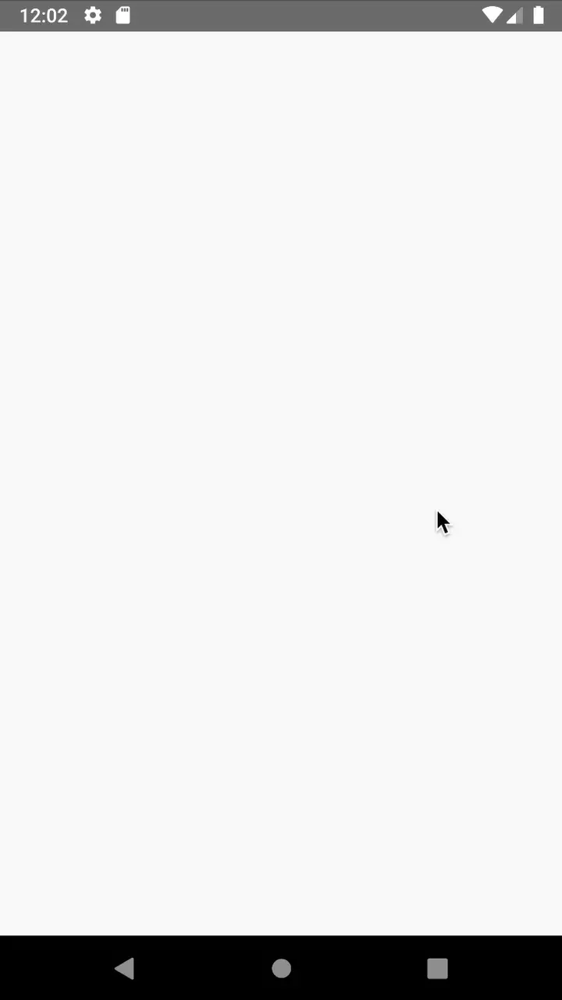

summary: Creation an application based on moko-template
id: giphy-app-1-en
categories: lang-en,moko,moko-template
status: published
Feedback Link: https://github.com/icerockdev/kmp-codelabs/issues
Analytics Account: UA-81805223-5
Author: Aleksey Mikhailov <am@icerock.dev>

# GiphyApp #1 - Creation an application based on moko-template
## Intro
Duration: 5

In this lesson we will cover developing small application for iOS and Android using [Kotlin Multiplatform](https://kotlinlang.org/docs/reference/multiplatform.html) based on [moko-template](https://github.com/icerockdev/moko-template).

### Tools
We will need: 
- Android Studio 3.4.0+ (**do not use 3.5.1 version, cause there is a [bug is breaking MPP project](https://youtrack.jetbrains.com/issue/KT-34143)**);
- Xcode 10.3+;
- Xcode Command Line Tools (`xcode-select --install`);
- [CocoaPods](https://cocoapods.org/) (`sudo gem install cocoapods`);
- [JDK](https://www.oracle.com/technetwork/java/javase/downloads/jdk8-downloads-2133151.html) - required to run `gradle` from `Xcode build phase`.

### The Result
As the result of `GiphyApp` lessons you will get an application to view gif files using [GIPHY API](https://developers.giphy.com/docs/api). 
UI of this application will be completely native, player of gif files will make using native libraries [glide](https://github.com/bumptech/glide) for Android and [SwiftyGif](https://github.com/kirualex/SwiftyGif) for iOS.

|android app|ios app|
|---|---|
|||

Final code is on [github](https://github.com/Alex009/giphy-mobile) repository.

## Create the project based on moko-template
Duration: 5

For creation we will use project template from [moko-template](https://github.com/icerockdev/moko-template). 

Positive
: The project template already has preconfigured builds of iOS and Andoroid application with shared library and you will save the time to integrate shared library to iOS project on iOS platform, to configure Kotlin Multiplatform modules and dependencies (using [mobile-multiplatform-gradle-plugin](https://github.com/icerockdev/mobile-multiplatform-gradle-plugin) you can make configuraion is simplier). 
The project template has a sample of several features as well as. 

### Use this template
To use this template you have to go on [GitHub repo moko-template](https://github.com/icerockdev/moko-template) and press a green button `Use this template`. As the result, you create a new repository according to the last commit of  `master` branch of `moko-template` project.

After succefull creation you should clone this rep:  `git clone <git url of repo>`.

## Test build
Duration: 5

To be sure that start state is correct, will run the both applications. To do this: 
- on Android: open root repository directory in Android Studio, wait while `Gradle Sync` will finish, and run `android-app` as regular application. 
- on iOS: install project's CocoaPods (in directory `ios-app` run a command `pod install`, and after this open `ios-app/ios-app.xcworkspace` in Xcode and press `Run` for running application. 

Positive
: Building of Kotlin/Native can take a time (it will start automatically on doing `pod install` as well as building iOS project). 

## Setting up an application identifiers 
Duration: 10

You can set an appllication identifiers like you do in regular Android and iOS application: 

### Change Appliсation Id
Android - in file `android-app/build.gradle.kts` need to change:
```kotlin
android {
    ...

    defaultConfig {
        ...
        
        applicationId = "dev.icerock.codelab.giphy"
        ...
    }
}
```
iOS - you have to set `Bundle Identifier` in the project's setting in Xcode like on the screenshot below:  


### Change an application name 
Android - in file `android-app/src/main/res/values/strings.xml` change:
```xml
<resources>
    <string name="app_name">Giphy App</string>
    ...
</resources>
```
iOS - you have to set `Display name` in the project's setting in Xcode like on the screenshot below:  


### Change an application icon
You can download the icon's resources [here](assets/giphy-1-icons.zip).  

To change Android icons you have to move content of `android` directory of this archive in `android-app/src/main/res` directory. After this, you need to set this icon on `android-app/src/main/AndroidManifest.xml`:

```xml
<manifest>
    <application
        ...
        android:icon="@mipmap/ic_launcher">
        ...
    </application>
</manifest>
```
To change icons on iOS you have to replace `ios-app/assets.xcassets/AppIcon.appiconset` directory by the archive's version. 

### Change launch screen 
There is a launch screen on iOS and to replace it you have to modify `ios-app/src/ReLaunchScreen.storyboard` file. For example, let's just change a text like on screenshot: 


## Next steps 
Duration: 3

On the next lesson [GiphyApp #2](https://codelabs.kmp.icerock.dev/codelabs/giphy-app-2) we will create a Gif list. 
