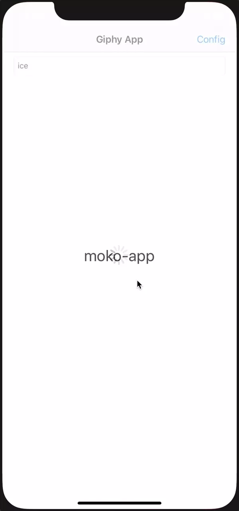
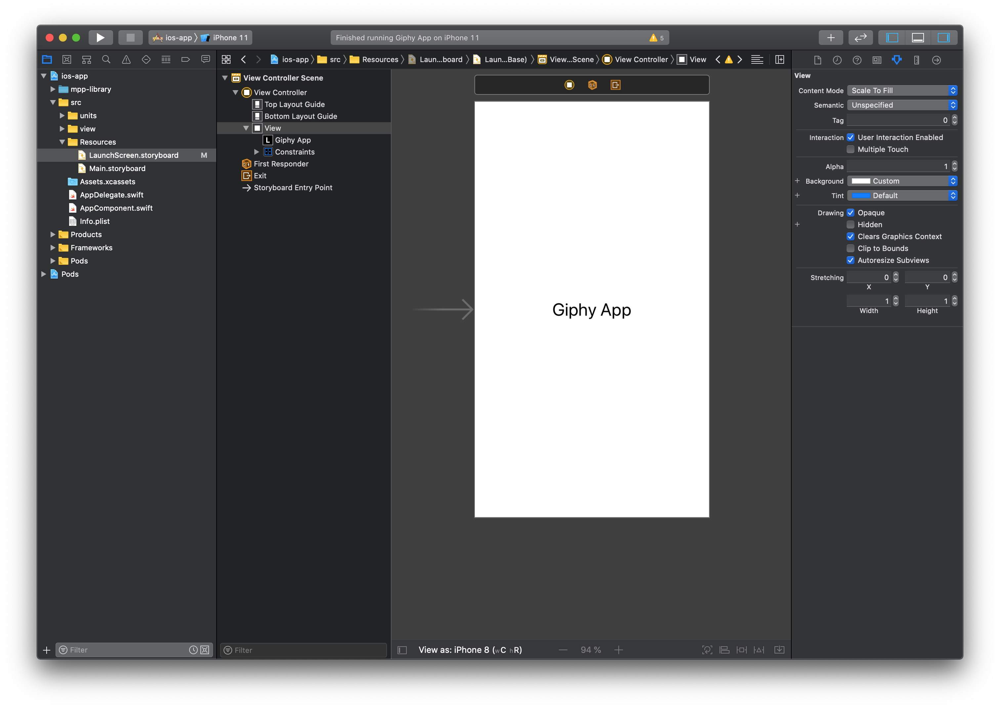

summary: Создание приложения на базе moko-template
id: giphy-app-1-ru
categories: lang-ru, moko, moko-template
status: published
Feedback Link: https://github.com/icerockdev/kmp-codelabs/issues
Analytics Account: UA-81805223-5
Author: Aleksey Mikhailov <am@icerock.dev>

# GiphyApp #1 - Создание приложения на базе moko-template
## Вводная
Duration: 5

В этом руководстве будет описано создание небольшого приложения под Android и iOS с технологией [Kotlin Multiplatform](https://kotlinlang.org/docs/reference/multiplatform.html) основываясь на шаблоне [moko-template](https://github.com/icerockdev/moko-template). 

### Инструменты
Для работы потребуется:
- Android Studio 3.4.0+ (**не 3.5.1 так как там [баг, ломающий mpp](https://youtrack.jetbrains.com/issue/KT-34143)**);
- Xcode 10.3+;
- Xcode Command Line Tools (`xcode-select --install`);
- [CocoaPods](https://cocoapods.org/) (`sudo gem install cocoapods`);
- [JDK](https://www.oracle.com/technetwork/java/javase/downloads/jdk8-downloads-2133151.html) - требуется для запуска `gradle` из `Xcode build phase`.

### Финальный результат
В результате выполнения всех руководств серии `GiphyApp` будет получено приложение просмотра гифок с использованием [GIPHY API](https://developers.giphy.com/docs/api). Интерфейс приложения будет полностью нативный, проигрывание Gif будет сделано нативными библиотеками [glide](https://github.com/bumptech/glide) для Android и [SwiftyGif](https://github.com/kirualex/SwiftyGif) для iOS. 

|android app|ios app|
|---|---|
|||

Готовый код проекта доступен на [github](https://github.com/Alex009/giphy-mobile).

## Создание проекта из moko-template
Duration: 5

Для создания проекта будет использован шаблон [moko-template](https://github.com/icerockdev/moko-template). 

Positive
: Шаблон имеет настроенную конфигурацию сборки Android и iOS приложений с общей библиотекой, что позволяет не тратить время на интеграцию сборки общей библиотеки под iOS с iOS проектом, на конфигурирование Kotlin Multiplatform модулей и зависимостей (используя [mobile-multiplatform-gradle-plugin](https://github.com/icerockdev/mobile-multiplatform-gradle-plugin) конфигурация значительно упрощена). Так же шаблон имеет несколько фич-примеров.

### Use this template
Чтобы использовать шаблон нужно перейти на [GitHub репозиторий шаблона moko-template](https://github.com/icerockdev/moko-template) и нажать зеленую кнопку `Use this template`. Этим действием мы создадим новый репозиторий с контентом, соответствующим последнему коммиту из `master` ветки `moko-template`.

После успешного создания нового репозитория склонируем репозиторий себе - `git clone <git url of repo>`.

## Тестовая сборка
Duration: 5

Чтобы убедиться, что стартовое состояние корректно работает - запустим оба приложения. Для этого нужно:
- Android - открываем через Android Studio корневую директорию репозитория, после завершения `Gradle Sync` можно запустить модуль `android-app` как обычное приложение;
- iOS - устанавливаем CocoaPods проекта - в директории `ios-app` запускаем `pod install`, а после завершения открываем `ios-app/ios-app.xcworkspace` и жмем `Run` для запуска приложения.

Positive
: Время сборки Kotlin/Native части продолжительное (сборка запускается автоматически при `pod install` для корректной интеграции в проект, а так же при сборке iOS проекта).

## Настройки идентификации приложения
Duration: 10

Настройки индентификации приложения вносятся полностью так же, как и в обычных Android и iOS приложениях.

### Изменение Appliсation Id
Android - в файле `android-app/build.gradle.kts` изменить:
```kotlin
android {
    ...

    defaultConfig {
        ...
        
        applicationId = "dev.icerock.codelab.giphy"
        ...
    }
}
```
iOS - в Xcode в настройках проекта указать `Bundle Identifier` как на скриншоте:  


### Изменение имени приложения
Android - в файле `android-app/src/main/res/values/strings.xml` изменить:
```xml
<resources>
    <string name="app_name">Giphy App</string>
    ...
</resources>
```
iOS - в Xcode в настройках проекта указать `Display name` как на скриншоте:


### Изменение иконки
Ресурсы иконки можно скачать [по ссылке](assets/giphy-1-icons.zip).  
Для замены Android иконок нужно перенести содержимое из директории `android` архива в `android-app/src/main/res`. После этого нужно указать иконку в `android-app/src/main/AndroidManifest.xml`:
```xml
<manifest>
    <application
        ...
        android:icon="@mipmap/ic_launcher">
        ...
    </application>
</manifest>
```
Для замены на iOS требуется заменить директорию `ios-app/assets.xcassets/AppIcon.appiconset` на версию из архива.

### Изменение загрузочного экрана
Загрузочный экран есть на iOS и меняется он через Xcode в файле `ios-app/src/ReLaunchScreen.storyboard`. Для примера просто заменим текст, как на скриншоте:


## Дальнейшие шаги
Duration: 3

В следующем руководстве [GiphyApp #2](https://codelabs.kmp.icerock.dev/codelabs/giphy-app-2) разобрана реализация списка Gif.
