id: kmm-icerock-onboarding-1-ru
categories: lang-ru,kmm-icerock-onboarding,moko
status: published
authors: Andrey Kovalev, Aleksey Lobynya, Aleksey Mikhailov
tags: onboarding,kmm,ios,android,moko
feedback link: https://github.com/icerockdev/kmp-codelabs/issues

# IceRock KMM onboarding #1 - разворачивание проекта

## Вводная

Duration: 5

Привет! Если ты это читаешь, значит ты начинаешь погружаться в процессы мультиплатформенной
разработки в IceRock.

Мы активно применяем и продвигаем этот подход с лета 2018 года. Основная его ценность для нас - это
возможность объединения бизнес-логики приложения в одном месте для обеих платформ. Вместо того,
чтобы отлаживать и реализовывать логику отдельно для iOS и Android мы пишем общий код, который
используют обе платформы. Один и тот же код. Соответственно, баги, связанные с некорректной логикой,
не будут плавать с платформы на платформу. И не потребуется отвлекать разных разработчиков -
проблемы в логике могут быть исправлены одним человеком, в одном месте и починить сразу и iOS, и
Android. Круто же)

При этом взаимодействие с пользователем остаётся 100% нативным. Доступен полный набор всех средств,
которые предоставляют нативные SDK. Юзер использует привычные элементы и приложение ведёт себя так,
как привыкли пользователи каждой платформы.

Обратная сторона медали - сложности на первых порах, при вхождении в такой подход и метод
разработки. Для андроид-разработчиков особо ничего не меняется - они могут использовать всё тот же
Kotlin, модульность, Gradle, корутины и прочие незнакомые большинству iOS-ников вещи. А
iOS-разработчик, в свою очередь, попадая впервые на мультиплатформенный проект, едет кукухой от
того, что в проект подцепляется какой-то мультиплатформенный под-чёрный-ящик, в котором какая-то
куча вьюмоделей, реализующих внутри магию с логикой, кругом какие-то диспатчеры, юниты, экран со
сложной вёрсткой в контроллере состоит из таблицы и нескольких строчек биндинга, не понятно откуда
что берётся и вопросов больше, чем ответов.

На самом же деле всё довольно просто и логично. Сгруппировано, разбито и структурировано. Но
вникнуть в эту концепцию придя на уже живущий проект, находящийся в активной разработке сложно из-за
большого объёма информации и логики.

Поэтому мы сделали набор Codelabs, которые призваны помочь пройтись по шагам по основным моментам,
ежедневно встречающимся в нашей повседневной разработке. В них ты сможешь по очереди выполнять
задания, наращивать функционал тестового проекта и изучать устройство проекта изнутри.

## Настройка рабочего окружения

Duration: 30

Positive: Для полноценной работы с KMM потребуется macOS, так как iOS приложение (и iOS версию kotlin
библиотеки) можно скомпилировать только на macOS - это ограничение от Apple (требуется Xcode
доступный только на macOS). На других платформах будет доступна только компиляция под Android. Код
common части писать и отлаживать можно, но без возможности проверить его работу под iOS.

Все нижеописанные инструкции будут выполнены на операционной системе macOS.

### Git (Android, iOS)

Для всех разработчиков в компании git требуется по умолчанию. Если он не установлен - нужно
установить (описывать это подробно не будем).

### Xcode (iOS)

Для компиляции iOS приложения, а также Kotlin библиотеки для iOS, потребуется Xcode. Его можно
установить из AppStore - [Xcode](https://apps.apple.com/ru/app/xcode/id497799835?mt=12).

Для установки потребуется Apple учетная запись. Если у вас уже есть собственный Apple ID - можете
использовать его. Если нету - можно зарегистрировать на корпоративную почту. При регистрации
потребуется привязка банковской карты, это обойти нельзя, поэтому привяжите любую карту (хоть
зарплатную) - если не выполнять покупок в AppStore то никаких списаний не будет (Xcode бесплатный).

После установки Xcode важно также установить `Xcode Command Line Tools` - они потребуются для
компиляции Kotlin/Native.

```bash
xcode-select --install
```

Убедиться что все успешно установлено вы можете запустив Xcode и зайдя в Preferences -> Locations.

В выборе `Command Line Tools` должна быть указана версия инструментов (если установка не выполнена -
будет указано что инструментов нет).

### Java Development Kit (Android, iOS)

Для работы с Kotlin Multiplatform потребуется установка Java Development Kit (JDK) версии 11. Это
требуется так как компилятор Kotlin и билд-система Gradle работают на базе Java Virtual Machine и
инструментария разработчиков Java.

Наиболее стабильно работает с Kotlin Multiplatform версия JDK от Oracle. Для скачивания потребуется
авторизоваться (либо зарегистрироваться), для регистрации можно использовать либо корпоративный либо
личный email - сама учетная запись ни для чего кроме скачивания JDK нам не потребуется.

[Download Oracle JDK 11](https://www.oracle.com/java/technologies/javase-jdk11-downloads.html)

После установки JDK требуется указать переменную окружения `JAVA_HOME`, чтобы все инструменты
работали с той версией Java, которую мы установили.

Сначала получим точный путь до только что установленного JDK - все версии лежат в
директории `/Library/Java/JavaVirtualMachines`, поэтому вводим в `Terminal`:

```bash
open /Library/Java/JavaVirtualMachines
```

После чего в открывшемся окне можем найти нашу JDK (рекомендуется так сделать чтобы точно понимать
какие версии Java установлены и где искать JDK если потребуется).

Итоговый путь до JDK получится примерно такой:
`/Library/Java/JavaVirtualMachines/jdk-11.0.10.jdk/Contents/Home`
минорная версия у вас может быть другой, но мажорная - 11. Базовая директория JDK находится
в `Contents/Home`.

Остается только сохранить путь до JDK в переменные окружения. Делается это изменением
файла `~/.zshenv` (пример сделан на базе `zsh`, так как для macOS это оболочка по умолчанию).

```bash
nano ~/.zshenv
```
или (для тех кто использует Visual Studio Code)

```bash
code  ~/.zshenv
```

ну или вы можете открыть файл в Finder (он находится в папке вашего пользователя) : 
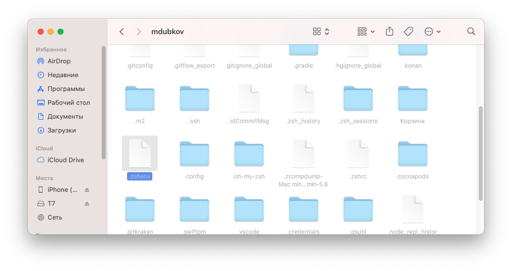

и в открывшемся редакторе добавляем строку:

```bash
export JAVA_HOME=/Library/Java/JavaVirtualMachines/jdk-VERSION.jdk/Contents/Home
```


Если же вы пользуетесь оболочкой bash, то вам нежно менять `~/.bash-profile`.

Negative
: Аккуратнее с copy-paste - минорная версия установленной у вас JDK может отличаться от приведенной
выше!

### Android Studio (Android, iOS)

Для работы с Kotlin кодом требуется IDE от JetBrains - IDEA либо Android Studio. Команда Kotlin
Multiplatform Mobile на данный момент основной
IDE [позиционируют Android Studio](https://kotlinlang.org/lp/mobile/ecosystem/) поэтому требуется
установить ее.

Для этого рекомендуем использовать [JetBrains Toolbox](https://www.jetbrains.com/toolbox-app/) - это
приложение будет самостоятельно следить за актуальностью используемой версии IDE и позволяет легко
устанавливать/обновлять все IDE от JetBrains.


Для установки просто нажимем Install напротив пункта `Android Studio`.

При первом запуске будет произведена первичная настройка. Настройки делайте на свое усмотрение, но
важно установить Android SDK последней версии.

Поле установки IDE требуется немного настроить. Во первых нужно исправить используемую JDK. Для
этого заходим в Android Studio, но **не открываем никакой проект**.


На Welcome экране выбираем `Configure` -> `Default Project Structure`. И в появившемся экране
выбираем `JDK Location` из `JAVA_HOME`:


Positive
: За счет этого выбора компиляция проектов через Android Studio будет производиться той же версией
JDK, которую будет использовать и Xcode. А это в свою очередь позволит использовать один Gradle
Daemon для компиляции одного и того же проекта, более эффективно используя ресурсы. Если же Android
Studio и Xcode будут использовать разные JDK, то компилируя проект в Android Studio и Xcode вы
получите два независимых java процесса, каждый из которых отнимет множество ресурсов (гигабайты
памяти).

После установки Android Studio для удобства стоит указать переменную окружения `ANDROID_SDK_ROOT`,
чтобы не было необходимости открывать проект через Android Studio перед запуском в Xcode.

Если не указывать переменную окружения, то при попытке компиляции Kotlin кода Gradle будет пытаться
считать путь до Android SDK из файла `local.properties` в корне проекта. И если данного файла нет -
будет ошибка. Android Studio автоматически создает этот файл с правильным путем до Android SDK при
открытии проекта через Android Studio, но если хочется не зависеть от факта "был ли открыт проект
через Android Studio ранее" - следует указать перменную окружения `ANDROID_SDK_ROOT`.

Берем путь до Android SDK, который мы могли увидеть ранее в `Welcome Screen` -> `Configure`
-> `Default Project Structure` и добавляем его в `~/.zshenv` ( или в `~/.bash-profile`) Действуем по аналогии с переменной `JAVA_HOME`.

После этого даже при отсутствии файла `local.properties` SDK будет успешно найдено.

Negative
: Начиная с Android Studio 4.2 сразу после установки необходимо отключить флаг в `Preferences` -> `Experimental` -> `Do not build Gradle task during Gradle sync` (с включенным флагом задачи на сборку модулей не появятся во вкладке `Gradle`)

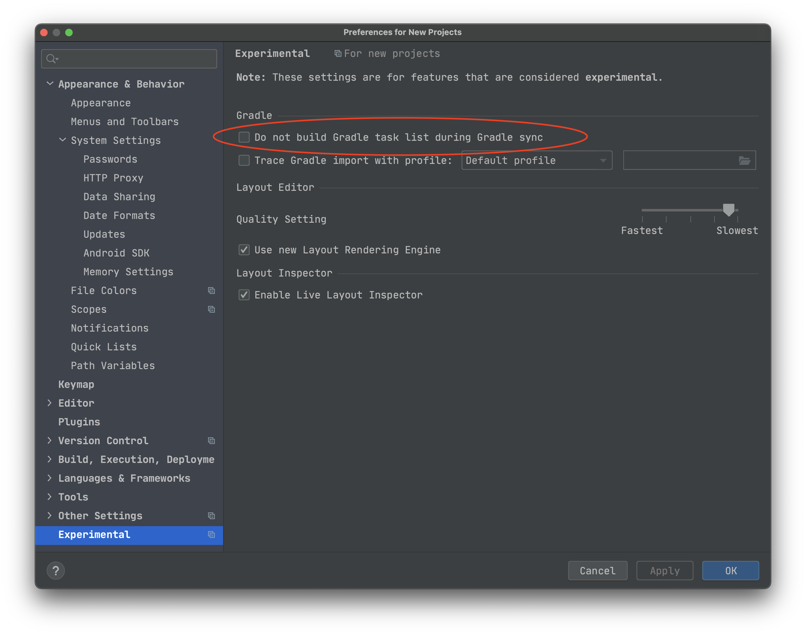

### CocoaPods (iOS)

Для работы с зависимостями на iOS мы используем CocoaPods, а также Kotlin модуль подключается в
Xcode проект через CocoaPods интеграцию. Поэтому требуется установить актуальную версию CocoaPods.

Подробная документация о установке [доступна на официальном сайте](https://cocoapods.org/#install).

Для тек кто использует HomeBrew информация о установке [доступна здесь](https://formulae.brew.sh/formula/cocoapods)

### Kotlin Multiplatform Mobile plugin (iOS)

JetBrains предоставляют для Android Studio
[специальный IDE плагин, под названием Kotlin Multiplatform Mobile](https://plugins.jetbrains.com/plugin/14936-kotlin-multiplatform-mobile)
, в котором:

- Шаблоны для создания KMM проекта / KMM модуля
- Запуск iOS приложения из Android Studio
- Отладка iOS приложения из Android Studio (можно поставить брейкпоинты в common коде на kotlin и
  при выполнении iOS приложение остановится в этом месте)

Доступен данный плагин только на macOS (так как запуск и отладка iOS приложения только на macOS
возможна).

Positive
: Важно понимать, что данный плагин не является обязательным требованием для работы с Kotlin
Multiplatform Mobile. Именование может вводить в заблуждение. Вы можете разрабатывать KMM приложения
и без данного плагина, он нужен только для более удобной разработки iOS части - возможность
отлаживать Kotlin доступна из Android Studio только через этот плагин.

Negative
: При обновлениях Kotlin могут происходить ситуации что данный плагин ломает работу IDE (например
IDE не может завершить Gradle Sync) - в таких случаях приходится вынужденно выключать данный плагин
и работать без него.

### Xcode Kotlin plugin (iOS)

Как альтернативу для Kotlin Multiplatform Mobile плагина для Android Studio, можно использовать
[Xcode Kotlin плагин для Xcode](https://github.com/touchlab/xcode-kotlin).

Он предоставляет возможность ставить брейкпоинты в Kotlin коде из Xcode:


Для установки просто скачайте
[актуальную версию с master](https://github.com/touchlab/xcode-kotlin/archive/refs/heads/main.zip)
, разархивируйте и запустите

```bash
./setup.sh
```

После чего открывайте Xcode и дайте разрешение использовать Kotlin плагин (при запуске будет окно)

- `Load Bundle`.

Positive
: После каждого обновления Xcode требуется повторно проводить операцию установки, скачивая
актуализированную версию плагина с GitHub.

После этого в проектах, где через folder-reference добавлены директории с kotlin кодом, можно
открыть kotlin файлы и ставить брейкпоинты, а дебаггер Xcode будет на них успешно останавливаться.
Более подробно установку брейкпоинтов рассмотрим чуть позже в разделе отладки.

### Проверка наличия всех необходимых переменных окружения

Откройте приложение Terminal и введите команду `export`. В полученном результате должны быть
следующие переменные:

- `JAVA_HOME`
- `ANDROID_SDK_ROOT`

Если их нет - нужно вернуться к вышестоящим пунктам и корректно установить переменные. 

*Внимание:*  новые переменные окружения появятся только после перезапуска сессии терминала.

### Gradle Build Environment

Открыв файл `gradle.properties`, который расположен в корневой папке проекта можно увидеть параметры сборки проекта.

- Параметр `org.gradle.parallel` отвечает за параллельное выполнение задач (если задачи не зависят друг от друга)
- Параметр `org.gradle.jvmargs` отвечает за запуск Java-машины и выделение ей памяти.
- Параметр `org.gradle.workers.max` отвечает за количество параллельных "Воркеров" или процессов (по умолчанию используется количество ядер вашего CPU)
- С остальными параметрами можете [ознакомиться тут](https://docs.gradle.org/current/userguide/build_environment.html).

Для комфортной работы вы можете изменить параметры Gradle не только для этого проекта, а для всех.
Для этого достаточно перейти в папку вашего пользователя и открыть папку `.gradle`:

```bash
cd ./gradle
```

Нам нужен файл `gradle.properties`

При при его отсутсвии:
```bash
touch gradle.properties
```

Октройте его
```bash
nano gradle.properties
```
или (для тех кто использует Visual Studio Code)
```bash
code gradle.properties
```

Вы также можете воспользоваться Finder: 
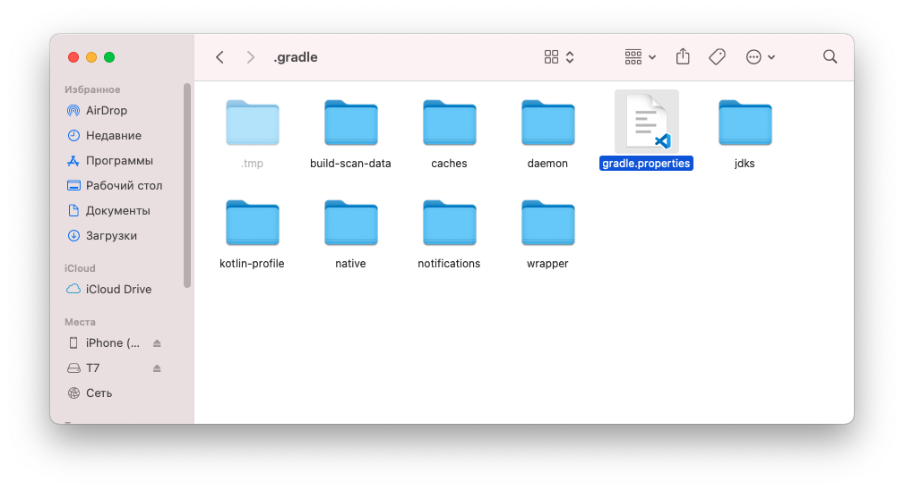

Вы можете объявить в этом файле любые настройки, которые будут приоритетнее чем настройки любого из запущенных проектов. Например: 
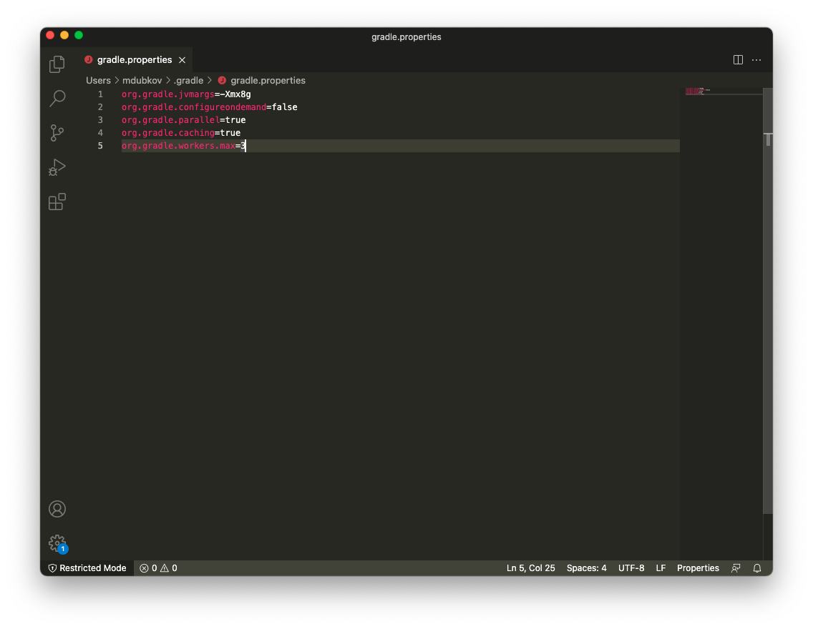


## Создаем проект

Duration: 10

В качестве отправной точки мы будем использовать наш шаблоный проект - **mobile-moko-boilerplate**.
Он используется на всех новых проектах для быстрого развёртывания и старта разработки. Там уже
подключены все минимально необходимые зависимости, имеется нужная структура папок и базовая
настройка проекта. Так что заходим на GitLab в репозиторий
<https://gitlab.icerockdev.com/scl/boilerplate/mobile-moko-boilerplate>
и делаем форк себе в профиль, клонируем.

После клонирования открываем проект в Android Studio. Для этого запускаем студию, File -> Open -> И
выбираем папку, в которую склонировали репозиторий. При первом открытии должно появиться
следующее:  

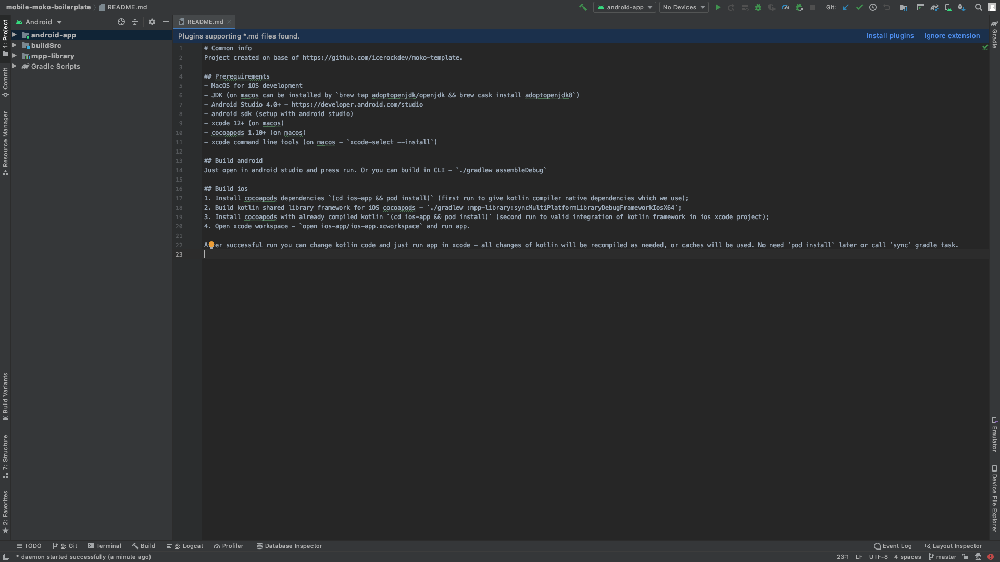

Так же должен запуститься Gradle Sync , если же этого не прозошло то запустите его самостоятельно.
*Примечание:* Gradle Sync - это задача gradle, которая просматривает все ваши зависимости, перечисленные в файлах build.gradle, и пытается загрузить указанную версию.

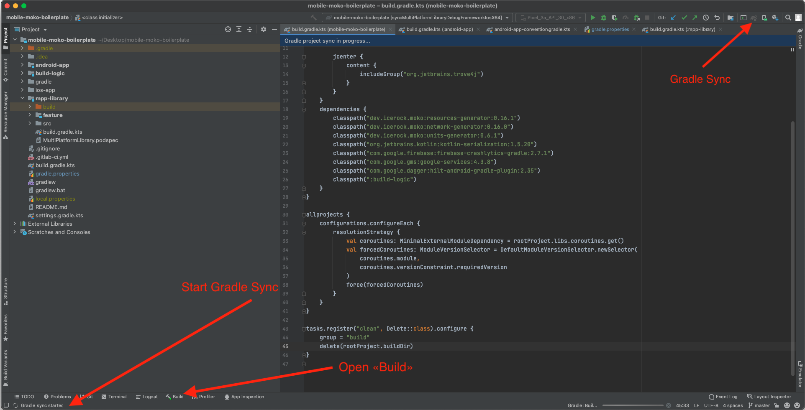

По-умолчанию студия парсит каталоги и строит отображение как для Android-проекта. Но мы здесь будем
работать не только с андроидом, но и с мультиплатформой. Поэтому переключаем отображение. Для этого
слева нажимаем на выпадашку Android и выбираем вместо него Project:  

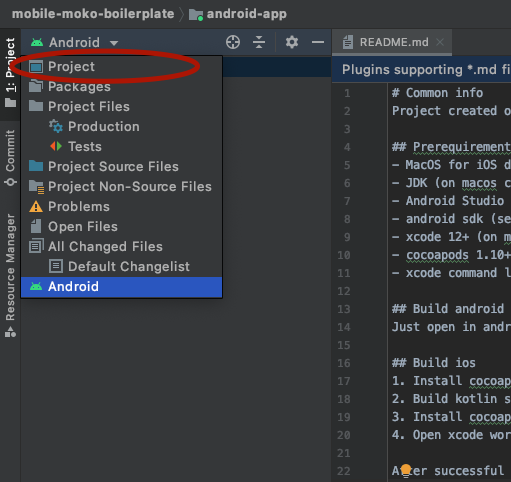

После этого структура папок немного изменится:  


Дожидаемся успешного выполнения Gradle Sync, чтобы в нашем проекте появились нужные Tasks. Если же Gradle Sync зафейлился, то читаем ошибку.


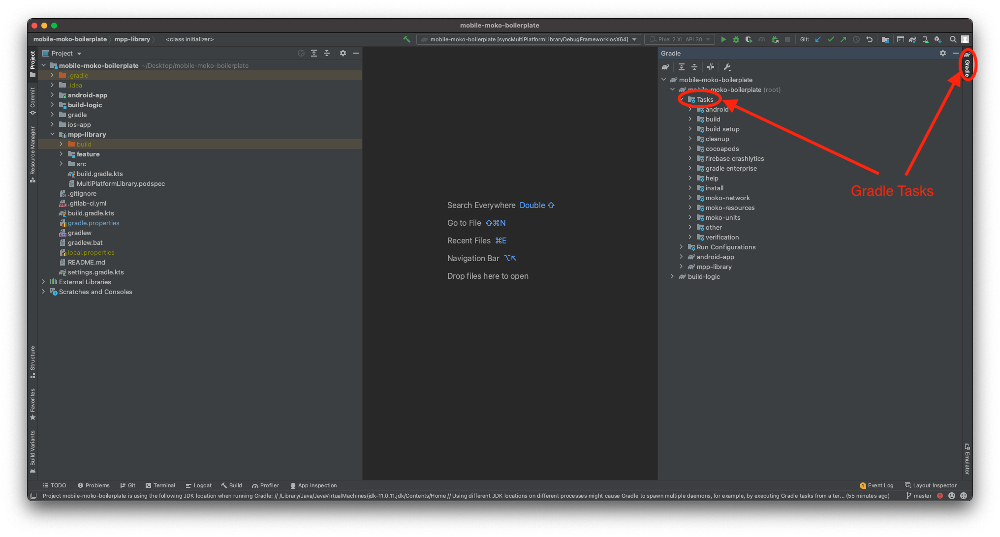

Positive
: В следующей CodeLab мы познакомимся детальнее с устройством проекта, а в данной части разберемся
как запускать и отлаживать код на обеих платформах с установленным нами инструментарием.

## Сборка Android

Duration: 5

### Сборка и запуск

Для запуска Android приложения все достаточно просто - достаточно в Android Studio запустить кнопку
Run и всё. Также просто как и при обычной разработке Android приложения.

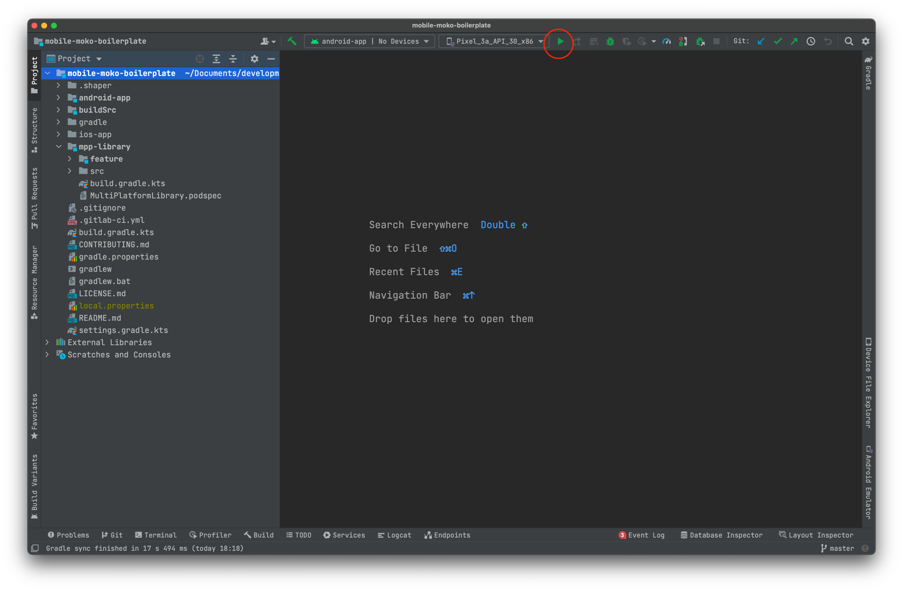

В результате произойдет сборка android версии общей библиотеки (mpp-library) и android приложения, а
после этого приложение запустится на выбранном устройстве / эмуляторе.


Если же нужно просто произвести сборку Android приложения, то можно использовать соответствующие
Gradle задачи.

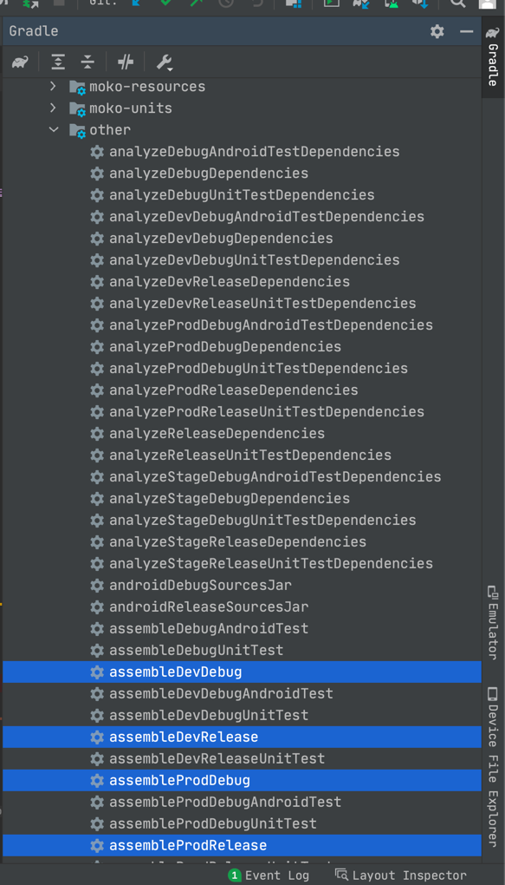

Все задачи начинающиеся на `assemble` отвечают за компиляцию проекта. Чаще всего требуется
задача `assembleDevDebug` - скомпилировать debug сборку для dev окружения. Debug типы задач
выполняются заметно быстрее Release версий, так как в них нет множества оптимизаций билда и
проверок. Для разработки следует использовать Debug версии.

### Выбор эмулятора
По умолчанию для запуска выбран `Pixel_3a_API_30_x86`.
Для выбора другого устройства вам нужно перейти в `AVD Manager -> Create Virtual Device...` и создать нужный вам эмулятор.


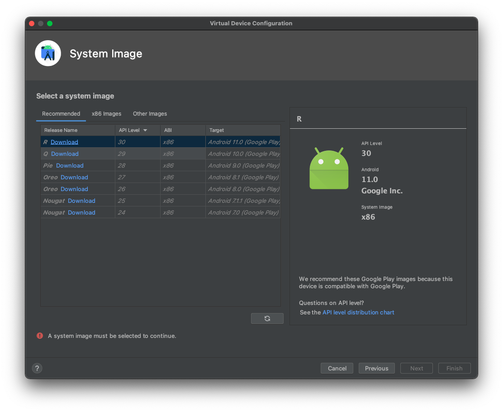

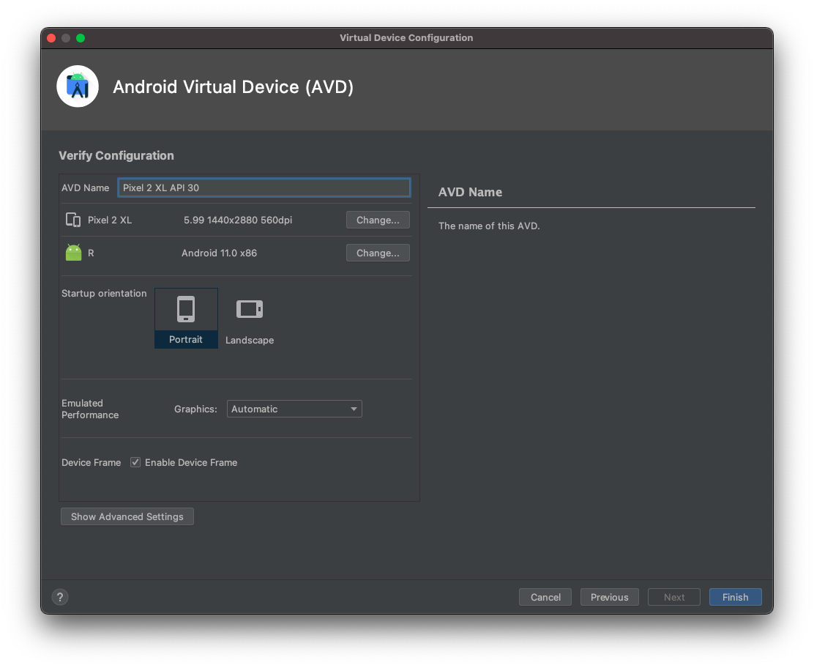

После чего вы можете использовать созданный симулятор для запуска проекта.


## Отладка Android

Duration: 5

Для отладки android приложения / общего кода на android достаточно поставить брейкпоинт и запустить
android через режим Debug (иконка жука).

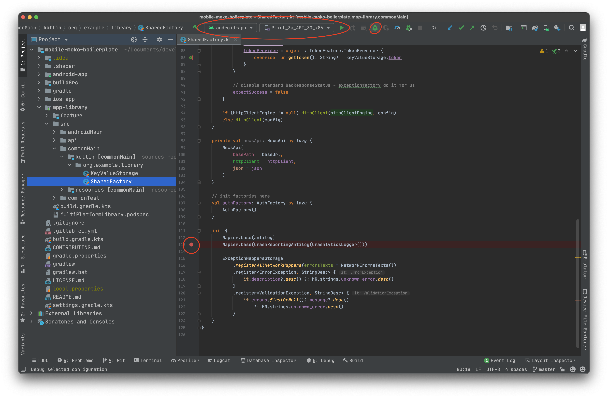

Когда произойдет остановка на брейкпоинте можно будет посмотреть стек вызовов и все содержимое
фреймов в стеке.

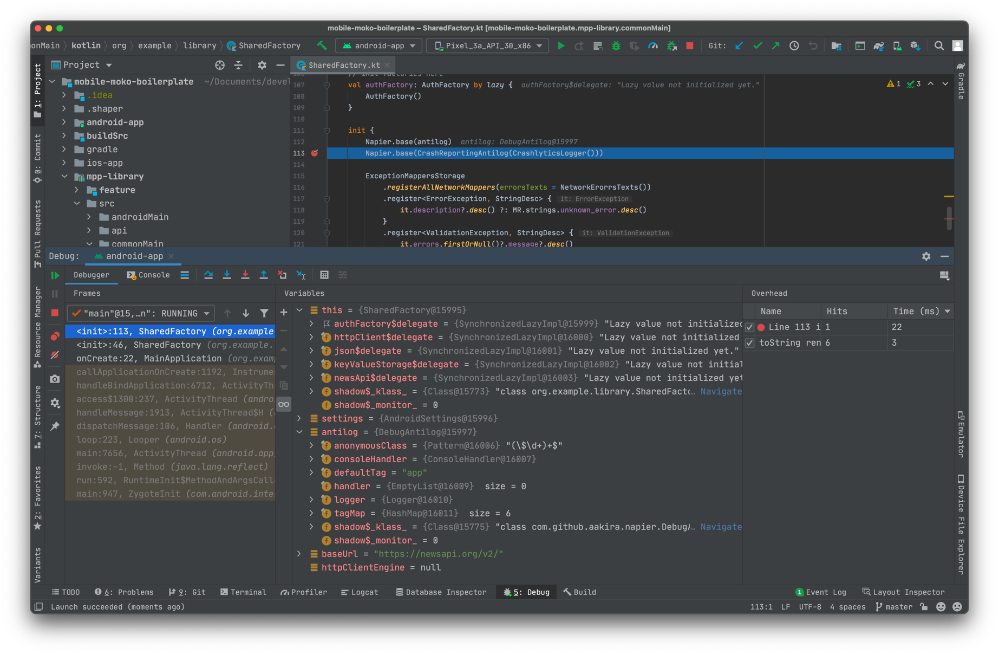

## Сборка iOS

Duration: 15

### Установка CocoaPods зависимостей

Перед первой компиляцией iOS требуется установить зависимости (они управляются через CocoaPods) -
переходим в директорию `ios-app` и выполняем `pod install`:

```bash
(cd ios-app && pod install)
```

Positive
: Чтобы не переключаться между IDE и терминалом - можно пользоваться терминалом прямо из студии.
Просто жмем снизу на панеле вкладку Terminal


Первоначальная установка CocoaPods требуется для компиляции Kotlin модуля, так как наш проект
зависит от нативных CocoaPod модулей (детальнее будет описано в следующей части).

### Компиляция MultiPlatformLibrary.framework (Kotlin модуль для iOS)

Теперь когда у нас установлены iOS зависимости, мы можем произвести компиляцию Kotlin модуля для
iOS. Для этого нам нужно запустить Gradle задачу `syncMultiPlatformLibraryDebugFrameworkIosX64`.
Сделать это мы можем несколькими путями:

1. Запустить в Terminal команду 
```bash
./gradlew syncMultiPlatformLibraryDebugFrameworkIosX64
```

2. Запустить через Android Studio задачу `syncMultiPlatformLibraryDebugFrameworkIosX64`


Стоит попробовать оба варианта, чтобы выбрать удобный для себя.

Компиляция займет некоторое время, так как Kotlin/Native (компилятор Kotlin для нативных платформ)
пока недостаточно оптимизирован на производительность. Пока идет компиляция стоит ознакомиться с
статьей [Gradle для iOS разработчиков на kmm.icerock.dev](https://kmm.icerock.dev/docs/for-ios-devs/gradle/)

### Установка CocoaPods зависимостей вместе с MultiPlatformLibrary

После успешного завершения сборки framework нужно повторно запустить установку CocoaPods:

```bash
(cd ios-app && pod install)
```

Это нужно потому что при первой установке CocoaPods не было файла MutliPlatformLibrary.framework (
так как для его компиляции требуется наличие других CocoaPods зависимостей) и поэтому CocoaPods не
до конца сконфигурировали интеграцию нашего проекта с фреймворком. А точнее не добавили в проект
фреймворк файл и команду для линковки. Поэтому после успешной компиляции фреймворка мы повторно
запускаем установку зависимостей CocoaPods и только после этого получаем полноценную интеграцию.

Проверить успешно ли произвелась интеграция Kotlin модуля в iOS проект можно посмотрев через Xcode:

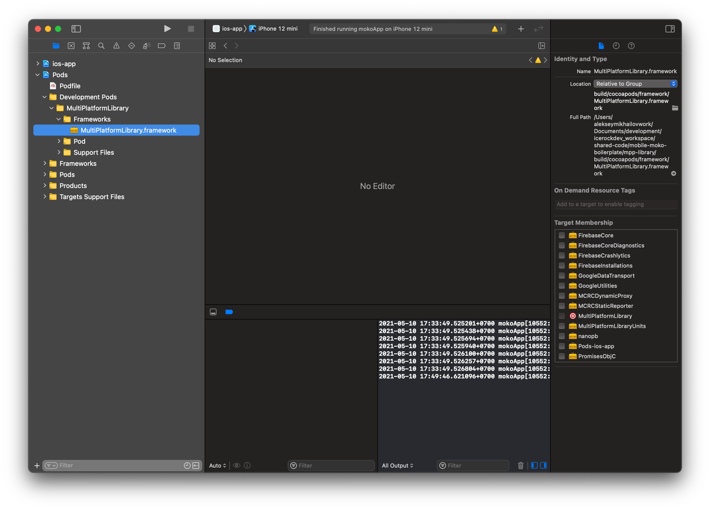

Если в `Pods/Development Pods/MultiPlatformLibrary/Frameworks` виден фреймворк, то интеграция
успешно настроена. Если у вас данный фреймворк не виден, то убедитесь что вы запустили установку
CocoaPods после того, как скомпилировали `MultiPlatformLibrary` задачей
`syncMultiPlatformLibraryDebugFrameworkIosX64`.

Positive
: если у вас происходят ошибки компиляции iOS приложения связанные с отсутствием
MultiPlatformLibrary, то проверьте успешна ли интеграция (проверкой наличия фреймворка по скриншоту
выше). 
А также проверьте наличие framework'а по пути, откуда его забирает CocoaPods интеграция 
`mpp-library/build/cocoapods/framework/MultiPlatformLibrary.framework`.


### Запуск iOS приложения


После успешной установки зависимостей CocoaPods (включая и MultiPlatformLibrary) можно открыть Xcode workspace:

```bash
open ios-app/ios-app.xcworkspace
```

#### Запуск на эмуляторе

Выбираем любой симулятор и запускаем проект нажатием на кнопку Run.


В результате увидим запущенное приложение:


#### Запуск на реальном устройстве

При запуске на реальном устройстве у вас появится ошибка:


Для решения этой проблемы перейдите в `ios-app.xcodeproj -> Targets -> Signing & Capabilities` и укажите там `Team` и `Bundle Identifier`.

После этого нужно заменить `Bundle Identifier` в названии файла синхронизации Firebase и `BUNDLE_ID` внутри самого файла. 
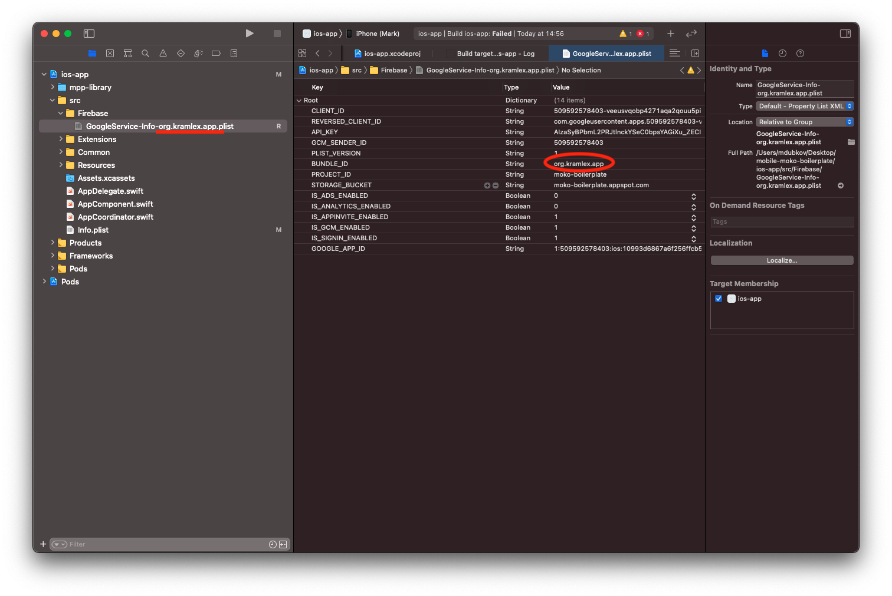

После этих действий пробуем запустить приложение на девайсе и видим это: 


У нас получилось запустить приложение на реальном устройстве


### Сборка напрямую из Android Studio

При использовании плагина Kotlin Multiplatform Mobile доступна возможность запускать ios приложение
напрямую из Android Studio.

Данный способ не отменяет всей работы с CocoaPods - он может быть альтернативой только для запуска
iOS приложения через Xcode.

Для начала один раз потребуется настроить конфигурацию запуска. Выбираем в Android Studio
пункт `Edit Configurations`:


И в открывшемся окне выбираем `ios-app`. В настройках данной конфигурации выбираем:

* `Xcode project scheme` = `mokoApp`
* `Execution target` = желаемый симулятор / устройство


После настроек жмем `Apply` для сохранения, выбираем конфигурацию `ios-app` и запускаем приложение.


### Write-Compile-Debug cycle

Цикл разработки "пишем код" -> "компилируем" -> "запускаем" требует меньше действий чем описано
выше. После первичной установки зависимостей для проверки изменений в коде достаточно просто
нажимать `Run` в Xcode / Android Studio - интеграция через CocoaPods автоматически произведет
компиляцию и Kotlin модуля, поэтому изменения в коде общей библиотеки и в коде ios проекта будут
учтены в новом билде. Запуск `pod install` может потребоваться повторно в случаях когда добавлюятся
новые нативные CocoaPods зависимости в `Podfile`.

## Отладка iOS

Duration: 10

### Отладка используя Xcode

За счет установленного плагина [xcode-kotlin](https://github.com/touchlab/xcode-kotlin). Мы можем
указать breakpoint в Kotlin коде напрямую из Xcode. Для этого нужно чтобы в Xcode проект были
добавлены файлы Kotlin кода через folder-reference. В нашем проекте добавлена ссылка на
директорию `mpp-library`, в которой находятся все мультиплатформенные модули.

Для примера работы с брейкпоинтами открываем в Xcode файл
`mpp-library/src/commonMain/kotlin/org/example/library/SharedFactory.kt`
и ставим брейкпоинт (нажатием на номер строки) на строке в конструкторе класса с инициализацией
логгера `Napier`.

```kotlin
Napier.base(CrashReportingAntilog(CrashlyticsLogger()))
```


Далее запускаем приложение и сразу при запуске получим остановку на этом брейкпоинте.


В отладчике видно стектрейс, с понятным стеком вызовов (kotlin функции начинаются с `kfun:`), а
также видим что данные доступные в текущем фрейме частично видны для анализа:

- видно свойства текущего объекта в `_this`
- видно аргументы конструктора `settings`, `antilog`, `baseUrl`, `httpClientEngine`

Отладчик все еще не стабильно работает с Kotlin кодом, поэтому операции пошагового выполнения могут
приводить к неожиданным результатам, а команды lldb типа `po` выдавать креши, но в будущем это тоже
будет улучшено.

Так же не стоит забывать про lldb-отладчик: 


Об Advanced Debugging with Xcode можете почитать [тут](https://medium.com/headout-engineering/advanced-debugging-with-xcode-9eba2845232a)

### Отладка используя Android Studio

При использовании плагина Kotlin Multiplatform Mobile можно проводить отладку kotlin кода в iOS из
Android Studio. Для этого устанавливаем брейкпоинт (нажатием справа от номера строки) на нужную
строку:


и после этого можем запускать приложение используя кнопку Debug (жук):


После запуска отладки произойдет остановка на брейкпоинте и мы увидим стектрейс и данные с текущего
фрейма - также как и в Xcode.


### Отладка через Xcode vs Android Studio

При отладке через Xcode мы можем видеть данные фрейма не только Kotlin части но и Swift, можем
переключаться по стектрейсу в Swift код и смотреть что было передано в Kotlin при вызове. При
отладке через Android Studio весь Swift код будет недоступен, только Kotlin часть будет поддаваться
анализу. Но в тоже время через Android Studio доступна вся навигация и анализ Kotlin кода, которые
не доступны при отладке через Xcode. Каждый может выбрать более подходящий под его текущие нужды
инструмент.

## Запуск тестов

Duration: 5

Тесты написанные в Kotlin модуле запускаются в обоих окружениях - в android и в iOS, что позволяет
найти специфичные для конкретной платформы проблемы.

Запуск тестов выполняется через gradle задачи:

* `build` - скомпилировать все платформы (компилируются даже те бинарники, которые не нужны для
  тестов) и запустить все проверки (самый долгий вариант)
* `test` - запустить все тесты (и скомпилировать бинарники необходимые для проведения тестов)
* `iosX64Test` - запустить все тесты на iOS платформе
* `testDebugUnitTest` - запустить все тесты на Android платформе

Попробуйте запустить тесты через `test`:

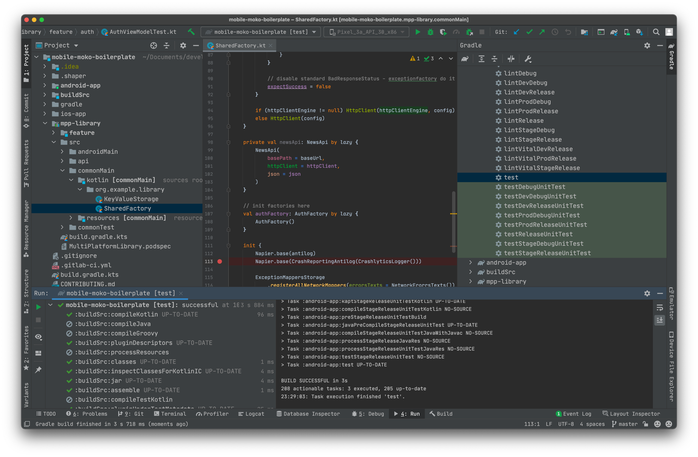

Помимо запуска через gradle задачи можно запустить тесты точечно:

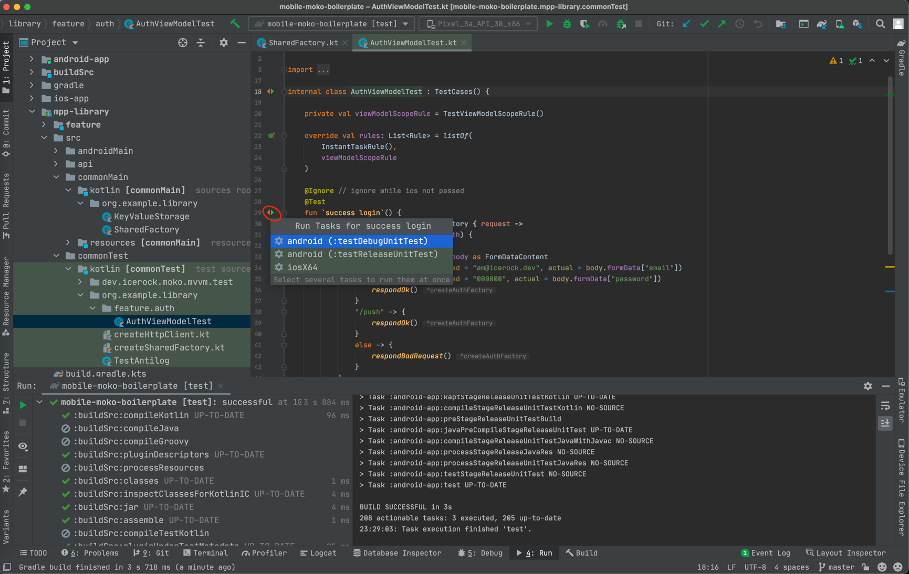

Написание тестов будет разбираться подробнее в дальнейших CodeLabs.

## Итоги

Duration: 5

И это успех) Мы выкачали и собрали мультиплатформенный проект с нуля. Аналогичным образом происходит
работа со всеми другими MPP-проектами в компании. Поэтому когда ты попадёшь на боевой проект, то уже
точно будешь знать, как его выкачать из репозитория, собрать и запустить у себя.
