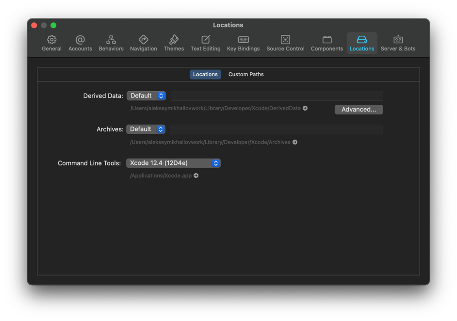
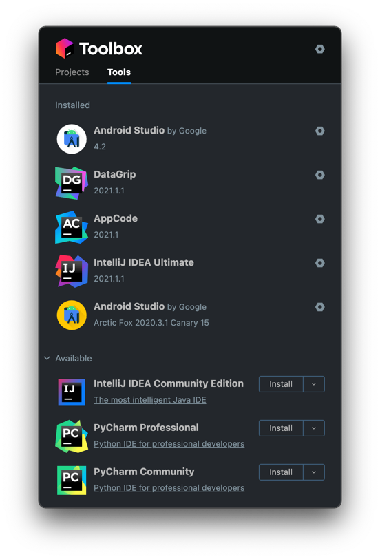
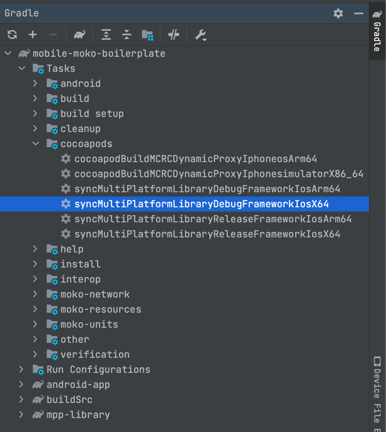

id: kmm-icerock-onboarding-1-ru
categories: lang-ru,kmm-icerock-onboarding,moko
status: published
authors: Andrey Kovalev, Aleksey Lobynya, Aleksey Mikhailov
tags: onboarding,kmm,ios,android,moko
feedback link: https://github.com/icerockdev/kmp-codelabs/issues

# IceRock KMM onboarding #1 - разворачивание проекта

## Вводная

Duration: 5

Привет! Если ты это читаешь, значит ты начинаешь погружаться в процессы мультиплатформенной
разработки в IceRock.

Мы активно применяем и продвигаем этот подход с 2017-2018 годов. Основная его ценность для нас - это
возможность объединения бизнес-логики приложения в одном месте для обеих платформ. Вместо того,
чтобы отлаживать и реализовывать логику отдельно для iOS и Android мы пишем общий код, который
используют обе платформы. Один и тот же код. Соответственно, баги, связанные с некорректной логикой,
не будут плавать с платформы на платформу. И не потребуется отвлекать разных разработчиков -
проблемы в логике могут быть исправлены одним человеком, в одном месте и починить сразу и iOS, и
Android. Круто же)

При этом взаимодействие с пользователем остаётся 100% нативным. Доступен полный набор всех средств,
которые предоставляют нативные SDK. Юзер использует привычные элементы и приложение ведёт себя так,
как привыкли пользователи каждой платформы.

Обратная сторона медали - сложности на первых порах, при вхождении в такой подход и метод
разработки. Для андроид-разработчиков особо ничего не меняется - они могут использовать всё тот же
Kotlin, модульность, Gradle, корутины и прочие незнакомые большинству iOS-ников вещи. А
iOS-разработчик, в свою очередь, попадая впервые на мультиплатформенный проект, едет кукухой от
того, что в проект подцепляется какой-то мультиплатформенный под-чёрный-ящик, в котором какая-то
куча вьюмоделей, реализующих внутри магию с логикой, кругом какие-то диспатчеры, юниты, экран со
сложной вёрсткой в контроллере состоит из таблицы и нескольких строчек биндинга,не понятно откуда
что берётся и вопросов больше, чем ответов.

На самом же деле всё довольно просто и логично. Сгруппировано, разбито и структурировано. Но
вникнуть в эту концепцию придя на уже живущий проект, находящийся в активной разработке сложно из-за
большого объёма информации и логики.

Поэтому мы сделали набор Codelabs, которые призваны помочь пройтись по шагам по основным моментам,
ежедневно встречающимся в нашей повседневной разработке. В них ты сможешь по очереди выполнять
задания, наращивать функционал тестового проекта и изучать устройство проекта изнутри.

## Настройка рабочего окружения

Duration: 30

Positive
: Для полноценной работы с KMM потребуется macOS, так как iOS приложение (и iOS версию kotlin
библиотеки) можно скомпилировать только на macOS - это ограничение от Apple (требуется Xcode
доступный только на macOS). На других платформах будет доступна только компиляция под Android. Код
common части писать и отлаживать можно, но без возможности проверить его работу под iOS.

### Git (Android, iOS)

Для всех разработчиков в компании git требуется по умолчанию. Если он не установлен - нужно
установить (описывать это подробно не будем).

### Xcode (iOS)

Для компиляции iOS приложения, а также Kotlin библиотеки для iOS, потребуется Xcode. Его можно
установить из AppStore - [Xcode](https://apps.apple.com/ru/app/xcode/id497799835?mt=12).

Для установки потребуетя Apple учетная запись. Если у вас уже есть собственный Apple ID - можете
использовать его. Если нету - можно зарегистрировать на корпоративную почту. При регистрации
потребуется привязка банковской карты, это обойти нельзя, поэтому привяжите любую карту (хоть
зарплатную) - если не выполнять покупок в AppStore то никаких списаний не будет (Xcode бесплатный).

После установки Xcode важно также установить `Xcode Command Line Tools` - они потребуются для
компиляции Kotlin/Native.

```bash
xcode-select --install
```

Убедиться что все успешно установлено вы можете запустив Xcode и зайдя в Preferences -> Locations.

В выборе `Command Line Tools` должна быть указана версия инструментов (если установка не выполнена -
будет указано что инструментов нет).

### Java Development Kit (Android, iOS)

Для работы с Kotlin Multiplatform потребуется установка Java Development Kit (JDK) версии 11. Это
требуется так как компилятор Kotlin и билд-система Gradle работают на базе Java Virtual Machine и
инструментария разработчиков Java.

Наиболее стабильно работает с Kotlin Multiplatform версия JDK от Oracle. Для скачивания потребуется
авторизоваться (либо зарегистрироваться), для регистрации можно использовать либо корпоративный либо
личный email - сама учетная запись ни для чего кроме скачивания JDK нам не потребуется.

[Download Oracle JDK 11](https://www.oracle.com/java/technologies/javase-jdk11-downloads.html)

После установки JDK требуется указать переменную окружения `JAVA_HOME`, чтобы все инструменты
работали с той версией Java, которую мы установили.

Сначала получим точный путь до только что установленного JDK - все версии лежат в
директории `/Library/Java/JavaVirtualMachines`, поэтому вводим в `Terminal`:

```bash
open /Library/Java/JavaVirtualMachines
```

После чего в открывшемся окне можем найти нашу JDK (рекомендуется так сделать чтобы точно понимать
какие версии Java установлены и где искать JDK если потребуется).

Итоговый путь до JDK получится примерно такой:
`/Library/Java/JavaVirtualMachines/jdk-11.0.10.jdk/Contents/Home`
минорная версия у вас может быть другой, но мажорная - 11. Базовая директория JDK находится
в `Contents/Home`.

Остается только сохранить путь до JDK в переменные окружения. Делается это изменением
файла `~/.zshenv` (пример сделан на базе `zsh`, так как для macOS это оболочка по умолчанию).

```bash
nano ~/.zshenv
```

и в открывшемся редакторе добавляем строку:

```bash
export JAVA_HOME=/Library/Java/JavaVirtualMachines/jdk-11.0.10.jdk/Contents/Home
```

Negative
: Аккуратнее с copy-paste - минорная версия установленной у вас JDK может отличаться от приведенной
выше!

### Android Studio (Android, iOS)

Для работы с Kotlin кодом требуется IDE от JetBrains - IDEA либо Android Studio. Команда Kotlin
Multiplatform Mobile на данный момент основной
IDE [позиционируют Android Studio](https://kotlinlang.org/lp/mobile/ecosystem/) поэтому требуется
установить ее.

Для этого рекомендуем использовать [JetBrains Toolbox](https://www.jetbrains.com/toolbox-app/) - это
приложение будет самостоятельно следить за актуальностью используемой версии IDE и позволяет легко
устанавливать/обновлять все IDE от JetBrains.



Для установки просто нажимем Install напротив пункта `Android Studio`.

При первом запуске будет произведена первичная настройка. Настройки делайте на свое усмотрение, но
важно установить Android SDK последней версии.

Поле установки IDE требуется немного настроить. Во первых нужно исправить используемую JDK. Для
этого заходим в Android Studio, но **не открываем никакой проект**.


На Welcome экране выбираем `Configure` -> `Default Project Structure`. И в появившемся экране
выбираем `JDK Location` из `JAVA_HOME`:


Positive
: За счет этого выбора компиляция проектов через Android Studio будет производиться той же версией
JDK, которую будет использовать и Xcode. А это в свою очередь позволит использовать один Gradle
Daemon для компиляции одного и того же проекта, более эффективно используя ресурсы. Если же Android
Studio и Xcode будут использовать разные JDK, то компилируя проект в Android Studio и Xcode вы
получите два независимых java процесса, каждый из которых отнимет множество ресурсов (гигабайты
памяти).

После установки Android Studio для удобства стоит указать переменную окружения `ANDROID_SDK_ROOT`,
чтобы не было необходимости открывать проект через Android Studio перед запуском в Xcode.

Если не указывать переменную окружения, то при попытке компиляции Kotlin кода Gradle будет пытаться
считать путь до Android SDK из файла `local.properties` в корне проекта. И если данного файла нет -
будет ошибка. Android Studio автоматически создает этот файл с правильным путем до Android SDK при
открытии проекта через Android Studio, но если хочется не зависеть от факта "был ли открыт проект
через Android Studio ранее" - следует указать перменную окружения `ANDROID_SDK_ROOT`.

Берем путь до Android SDK, который мы могли увидеть ранее в `Welcome Screen` -> `Configure`
-> `Default Project Structure` и добавляем его в `~/.zshenv`. Открываем редактирование:

```bash
nano ~/.zshenv
```

и добавляем там строку с путем до SDK, например: 
```bash
export ANDROID_SDK_ROOT=~/Library/android-sdk
```

После этого даже при отсутствии файла `local.properties` SDK будет успешно найдено. 

### CocoaPods (iOS)

Для работы с зависимостями на iOS мы используем CocoaPods, а также Kotlin модуль подключается в
Xcode проект через CocoaPods интеграцию. Поэтому требуется установить актуальную версию CocoaPods.

Подробная документация о установке [доступна на официальном сайте](https://cocoapods.org/#install).

### Kotlin Multiplatform Mobile plugin (iOS)

JetBrains предоставляют для Android Studio
[специальный IDE плагин, под названием Kotlin Multiplatform Mobile](https://plugins.jetbrains.com/plugin/14936-kotlin-multiplatform-mobile)
, в котором:

- Шаблоны для создания KMM проекта / KMM модуля
- Запуск iOS приложения из Android Studio
- Отладка iOS приложения из Android Studio (можно поставить брейкпоинты в common коде на kotlin и
  при выполнении iOS приложение остановится в этом месте)

Доступен данный плагин только на macOS (так как запуск и отладка iOS приложения только на macOS
возможна).

Positive
: Важно понимать, что данный плагин не является обязательным требованием для работы с Kotlin
Multiplatform Mobile. Именование может вводить в заблуждение. Вы можете разрабатывать KMM приложения
и без данного плагина, он нужен только для более удобной разработки iOS части - возможность
отлаживать Kotlin доступна из Android Studio только через этот плагин.

Negative
: При обновлениях Kotlin могут происходить ситуации что данный плагин ломает работу IDE (например
IDE не может завершить Gradle Sync) - в таких случаях приходится вынужденно выключать данный плагин
и работать без него.

### Xcode Kotlin plugin (iOS)

Как альтернативу для Kotlin Multiplatform Mobile плагина для Android Studio, можно использовать
[Xcode Kotlin плагин для Xcode](https://github.com/touchlab/xcode-kotlin).

Он предоставляет возможность ставить брейкпоинты в Kotlin коде из Xcode:
TODO IMAGE HERE

Для установки просто скачайте 
[актуальную версию с master](https://github.com/touchlab/xcode-kotlin/archive/refs/heads/main.zip)
, разархивируйте и запустите

```bash
./setup.sh
```

После чего открывайте Xcode и дайте разрешение использовать Kotlin плагин (при запуске будет окно).

Positive
: После каждого обновления Xcode требуется повторно проводить операцию установки, скачивая
актуализированную версию плагина с GitHub.

После этого в проектах, где через folder-reference добавлены директории с kotlin кодом, можно
открыть kotlin файлы и ставить брейкпоинты, а дебаггер Xcode будет на них успешно останавливаться.

## Подготовка общего кода

Duration: 10

В качестве отправной точки мы будем использовать наш шаблоный проект - **mobile-moko-boilerplate**.
Он используется на всех новых проектах для быстрого развёртывания и старта разработки. Там уже
подключены все минимально необходимые зависимости, имеется нужная структура папок и базовая
настройка проекта. Так что заходим на GitLab в репозиторий
[https://gitlab.icerockdev.com/scl/boilerplate/mobile-moko-boilerplate](https://gitlab.icerockdev.com/scl/boilerplate/mobile-moko-boilerplate)
и делаем форк себе в профиль, клонируем.

После клонирования открываем проект в Android Studio. Для этого запускаем студию, File -> Open -> И
выбираем папку, в которую склонировали репозиторий. При первом открытии должно появиться
следующее:  


По-умолчанию студия парсит каталоги и строит отображение как для Android-проекта. Но мы здесь будем
работать не только с андроидом, но и с мультиплатформой. Поэтому переключаем отображение. Для этого
слева нажимаем на выпадашку Android и выбираем вместо него Project:  


После этого структура папок немного изменится:  


## Сборка Android приложения

Duration: 5

Для сборки Android приложения все достаточно просто - достаточно в Android Studio запустить кнопку
Run и всё. Также просто как и при обычной разработке Android приложения.


В результате произойдет сборка android версии общей библиотеки (mpp-library) и android приложения, а
после этого приложение запустится на выбранном устройстве / эмуляторе.


## Сборка iOS приложения

Duration: 10

Далее соберём iOS проект. Как именно это сделать можно прочитать тут же в Readme открытого проекта.
Но чтобы было нагляднее - пройдём эти незамысловатые шаги для ios-проекта.

Сначала ставим CocoaPods - `pod install` (в директории `ios-app`).

Positive
: Чтобы не переключаться между IDE и терминалом - можно пользоваться терминалом прямо из студии.
Просто жмем снизу на панеле вкладку Terminal


После этого в Android Studio справа разворачиваем панель Gradle. Внутри Tasks/cocoapods находим
нужную нам таску - `syncMultiPlatformLibraryDebugFrameworkIosX64`:


и запускаем её двойным кликом. Тут придётся немного подождать. А чтобы лучше понять, что сейчас
произошло, как эти таски появились и что это за Gradle и слон со стрелкой - идём читать статейку про
[Gradle для айосников на kmm.icerock.dev](https://kmm.icerock.dev/pages/4.1.1-kmm-ios-gradle/).

После успешного завершения билда необходимо ещё раз выполнить установку подов. И далее можно
запускать Xcode и открывать проект, который лежит по пути `ios-app/ios-app.xcworkspace`.

Выбираем любой симулятор, жмём Run - проект собирается и запускается.


Negative
: Наиболее частая причина ошибок на этом шаге - неправильная последовательность действий. Если вдруг
что-то пошло не так, то проверь, что ты установил поды, выполнил синк, а после этого снова установил
поды.

## Итоги

Duration: 2

И это успех) Мы выкачали и собрали мультиплатформенный проект с нуля. Аналогичным образом происходит
работа со всеми другими MPP-проектами в компании. Поэтому когда ты попадёшь на боевой проект, то уже
точно будешь знать, как его выкачать из репозитория, собрать и запустить у себя.
