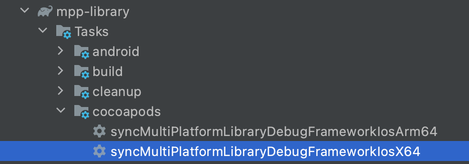
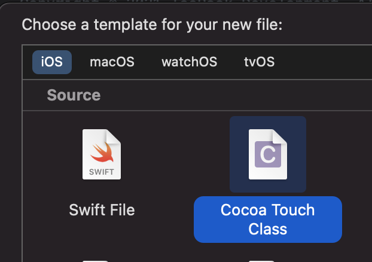
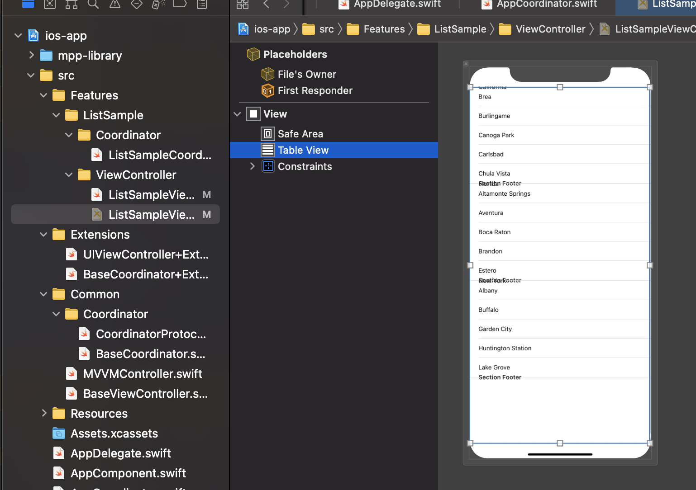
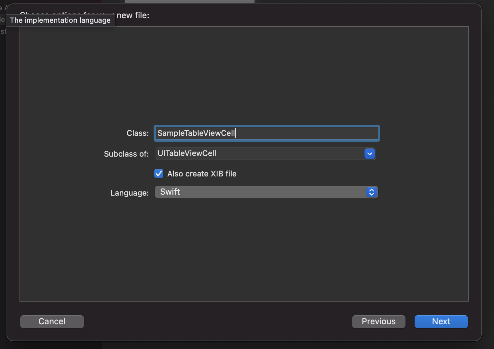
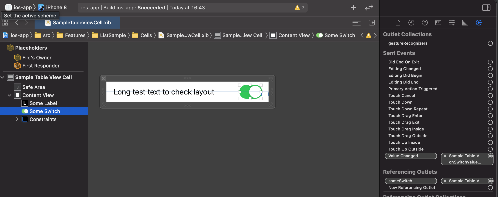

id: kmm-icerock-onboarding-3-ru
categories: lang-ru,kmm-icerock-onboarding,moko
status: published
authors: ??
tags: onboarding,kmm,ios,android,moko
feedback link: https://github.com/icerockdev/kmp-codelabs/issues

# IceRock KMM onboarding #3 - реализация фичи списка

## Вводная

В этой кодлабе мы рассмотрим как реализовать фичи списка по принятому в IceRock стандарту, используя наши библиотеки [moko-units](https://github.com/icerockdev/moko-units) и [moko-mvvm](https://github.com/icerockdev/moko-mvvm)
Основнная особенность нашего подхода - на нативных платформах используются UITableView/UICollectionView и RecyclerView, тогда как вся логика по построению списка этих элементов и наполнению данными реализуется в common коде.


## Добавляем в проект новую пустую фичу

Duration: 30

### Создаем новый модуль в mpp-library

Для начала, по аналогии с [третьей кодлабой](https://codelabs.kmp.icerock.dev/codelabs/kmm-icerock-onboarding-3-ru/index.html) по пути `mpp-library/feature/` создаем директорию для нашего модуля следующей структуры:

```tree
.
|____build.gradle.kts
|____src
| |____commonMain
| | |____kotlin
| | | |____org
| | | | |____example
| | | | | |____library
| | | | | | |____feature
| | | | | | | |____listSample
| | | | | | | | |____di
| | | | | | | | | |____ListSampleFactory.kt
| | | | | | | | |____presentation
| | | | | | | | | |____ListSampleViewModel.kt
| |____androidMain
| | |____AndroidManifest.xml
```

Здесь:
- вложенные директории org/example/library/feature/listSimple должны соответствовать имени пакета ([//TODO: ссылка на "почему так?"]())
- в директории di будет распологаться весь код внешнего создания вьюмодели доступный внешним модулям, сейчас это фабрика вьюмодели
- в директории presentation будет именно **ViewModel**-логика, то есть сами классы вьюмоделей и возможно что-нибудь вспомогательное для них, доступное только в рамках модуля фичи

Cтартовое состояние файлов такое же как в начале третьей кодлабы, только заменены имена классов и пакетов:

ListSampleViewModel.kt:
```kotlin
package org.example.library.feature.listSample.presentation

import dev.icerock.moko.mvvm.dispatcher.EventsDispatcher
import dev.icerock.moko.mvvm.dispatcher.EventsDispatcherOwner
import dev.icerock.moko.mvvm.viewmodel.ViewModel

class ListSampleViewModel(
    override val eventsDispatcher: EventsDispatcher<EventsListener>,
) : ViewModel(), EventsDispatcherOwner<ListSampleViewModel.EventsListener> {
    interface EventsListener	//пока что пустой интерфейс
}
```

ListSampleFactory.kt;
```kotlin
package org.example.library.feature.listSample.di

import dev.icerock.moko.mvvm.dispatcher.EventsDispatcher
import org.example.library.feature.listSample.presentation.ListSampleViewModel

class ListSampleFactory {
    fun createListViewModel(
        eventsDispatcher: EventsDispatcher<ListSampleViewModel.EventsListener>
    ) = ListSampleViewModel(
        eventsDispatcher = eventsDispatcher
    )
}
```

AndroidManifest.xml:
```xml
<?xml version="1.0" encoding="utf-8"?>
<manifest package="org.example.library.feature.listSample" />
```

Теперь нужно указать что наш модуль участвует в gradle-проекте. Добавляем его в `settings.gradle` в корне проекта:

```gradle
include(":mpp-library:feature:auth")
include(":mpp-library:feature:listSample") //добавляем наш новый модуль
```

Чтобы ссылаться на этот модуль, необходимо завести его в структуре зависимостей в файле ./buildSrc/src/main/kotlin/Deps.kt. Как и авторизацию, добавим его в список фичей:
```kotlin
    object Modules {
        object Feature {
            val auth = MultiPlatformModule(
                name = ":mpp-library:feature:auth",
                exported = true
            )
            
            //добавляем новым полем в класс
            val listSample = MultiPlatformModule(
                name = ":mpp-library:feature:listSample",
                exported = true
            )
        }
    }
```
флаг exported указывает что при сборке этот модуль попадет в платформенный фреймворк и будет доступен со стороны iOS, можно не указывать для модулей код которых не будет вызываться непосредственно с нативной части приложения

Теперь можно сослаться на модуль фичи из основного в ./mpp-library/build.gradle.kts:
```kotlin
val mppModules = listOf(
    Deps.Modules.Feature.auth,
    Deps.Modules.Feature.listSample //Добавляем наш модуль
)
```

Осталось выполнить синхронизацию gradle, плагин для студии предлагает сделать после каждого изменения gradle-файлов:


В итоге наш модуль доступен в основном коде mpp-library, как и для авторизации реализуем фабрику вьюмодели в ./mpp-library/SharedFactory.kt:
```kotlin
...
import org.example.library.feature.auth.di.AuthFactory
import org.example.library.feature.listSample.di.ListSampleFactory //можем добавить импорт самостоятельно, но IDE сама предложит это сделать при упоминании в коде классов из этого модуля

...

   // init factories here
    val authFactory: AuthFactory by lazy {
        AuthFactory()
    }

    // listSample factory setup
    val listSampleFactory: ListSampleFactory by lazy {
        ListSampleFactory()
    }

    init {
    ...
```

На этом базовый каркас заготовки фичи со стороны общего кода готов

### Создаем новый UIViewController на iOS, связываем  его с ViewModel

Выполняем нужную нам таску гредла из mpp-library/cocoapods/sync (в примере собиралась отладочная версия на симулятор):


Открываем XCode, в проекте по пути ./ios-app/src/Features создаем директорию для нашей фичи следующей структуры:
```
.
|____ListSample
| |____Coordinator
| | |____ListSampleCoordinator.swift
| |____ViewController
| | |____ListSampleViewController.xib
| | |____ListSampleViewController.swift
```
Пару файлов для контроллера рекомендуется создавать через XCode в диалоге New File -> Cocoa Touch class:


и выбрав в диалоге наследование от **UIViewController** и отметку о создании связанного XIB файла:


Класс контроллера должен наследоваться от **BaseViewController** с указанием класса вьюмодели:
```swift
import UIKit
import MultiPlatformLibrary

class ListSampleViewController: BaseViewController<ListSampleViewModel> {

    override func bindViewModel(_ viewModel: ListSampleViewModel) {
        super.bindViewModel(viewModel)
        print("ListSample: ready to bind")
    }
}
```

*В generic-классе **BaseViewController** заложена вспомогательная логика по очистке вьюмодели когда, событиях клавиатуры и многого другого, может пополняться полезными функциями от проекта к проекту*

В файле **ListSampleCoordinator** создаем контроллер, вьюмодель и показываем контроллер как корневой у текущего окна:
```swift
import UIKit
import MultiPlatformLibrary

class ListSampleCoordinator: BaseCoordinator, ListSampleViewModelEventsListener {
    override func start() {
        let viewController = ListSampleViewController()
        let viewModel = self.factory.listSampleFactory.createListViewModel(
            eventsDispatcher: EventsDispatcher(listener: self))
        viewController.bindViewModel(viewModel)
        beginInNewNavigation(viewController)
    }
}
```

*//TODO:  Оставить ссылку где можно подробнее посмотреть на координаторы*

Теперь осталось вызывать координатор фичи с предыдущего экрана или корня приложения. Вызовем из корня, для чего заменим метод start() в **AppCoordinator**:
```swift
class AppCoordinator: BaseCoordinator {
    override func start() {
        addDependency(
            ListSampleCoordinator(window: self.window, factory: self.factory),
            completion: nil
        ).start()
    }
}
```

Теперь после запуска приложения будет пустой экран и текст "ListSample: ready to bind" в консоли

### Создаем новый фрагемент/активность(?) на Android, связываем  его с ViewModel

//TODO: Дополнить андроидную часть


## Добавляем в фичу простой вариант списка 

Для примера реализуем список настроек состоящих из названия и переключателя вкл/выкл

Duration: 25

### Основная идея moko-units

С развитием KMM нужно было как-то перенести на уровень **ViewModel** управление списками, сделать его настройку простой и стандартной а реализацию переиспользуемой хотя бы между фичами одного проекта. В итоге пришли к следующей схеме:

1. На стороне **ViewModel** объявляем какие элементы списка нужны будут нашей ( интерфейс \*UnittFactory, только тип элемента и данные)
2. На стороне платформы реализуем интерфейс \*UnittFactory и предоставляем конструкторы этих элементов
3. На стороне **ViewModel** руководствуясь бизнес логикой генерируем массив элементов списка
4. На нативной стороне по предоставленному массиву заполянем UI

### Состав moko-units

Если описывать кратко, то возможности самой moko-units следующии:

1. Со стороны common-кода объявлены два пустых expect-интерфейса **CollectionUnitItem** и **TableUnitItem**
2. Со стороны iosMain/kotlin кода есть actual-объявления этих интерфейсов с  методами и параметрами необходимыми для создания ячеек коллекций и строк таблиц (`reusableIdentifier`), регистрации в таблице/коллекции (`fun register(...)`) , привязки \*UnitItem к ячейкам/строкам (`fun bind()`) и сравнения между собой (`val itemId: Long`)
3. //TODO: Про андроид непонятно, здесь кажется без expect/actual, все платформенное
4. Со стороны iosMain/kotlin есть реализации источников данных для таблиц/коллекции, умеющих работать с экземплярами этих интерфейсов.
5. Со стороны iosMain/swift есть вспомогательные протоколы и расширения, позволяющие реализовать создание \*UnitItem уже для конкретного пользоввательского класса ячейки и создать источник данных для нее
6. //TODO: Что со стороны андроида?

### Верстаем iOS

В ListViewController.xib добавляем **UITableView** на весь экран:


и выставляем outlet для нее в **ListViewController.swift**:
```swift
    @IBOutlet private weak var sampleTableView: UITableView!
```

В группе фичи создаем подгруппу **Cells** и по аналогии с контроллером добавляем в нее новый **Cocoa Touch Class** отнаследованный от **UITableViewCell**



Добавляем в xib ячейки необходимые элементы, их outlet'ы в класс и настраиваем действие на valueChanged:


```swift
    import UIKit

class SampleTableViewCell: UITableViewCell {

    @IBOutlet var someLabel: UILabel!
    @IBOutlet var someSwitch: UISwitch!
    
    @IBAction func onSwitchValueChanged(_ sender: UISwitch) {
        //TODO: Implement action
    }
}
```

На этом верстка готова

### Верстаем Android

//TODO: Сделать по аналогии

### Добавляем фабрику юнитов в common-коде

Для начала подключаем библитеку moko-units в зависимости нашей фичи. `mpp-library/feature/lisSample/build.gradle.kts`:
```kotlin
  ... 
  commonMainImplementation(Deps.Libs.MultiPlatform.mokoResources.common)
  commonMainImplementation(Deps.Libs.MultiPlatform.mokoUnits.common)
}
```
и выполняем синхронизацию gradle-проекта

Далее нужно по пути listSample/src/commonMain/org.example.library.feature.listSample/di  добавить файл **ListSampleUnitFactory.kt** с интерфейсом для фабрики юнитов и перечислить в методе создания юнита все что нам потребуется для настройки строки в списке:
```kotlin
package org.example.library.feature.listSample.di

import dev.icerock.moko.units.TableUnitItem

interface ListSampleUnitFactory {
    fun createSettingsUnit(
        id: Int,            //нужен будет для сравнения строк списка между собой
        name: String,       //прямо присвоится в поле
        boolValue: Boolean, //положение переключателя
        onValueChanged: ((Boolean) -> Unit) //лямбду которую надо вызвать при переключении
    ): TableUnitItem
}
```

Теперь добавляем этот интерфейс как обязательный параметр в конструкторе **ListSampleViewModel**:
```kotlin
class ListSampleViewModel(
    override val eventsDispatcher: EventsDispatcher<EventsListener>,
    private val unitFactory: ListSampleUnitFactory
) : ViewModel(), EventsDispatcherOwner<ListSampleViewModel.EventsListener> {
```
и соответственно в параметры метода **ListSampleFactory.createListViewModel**:
```kotlin
class ListSampleFactory {
    fun createListViewModel(
        eventsDispatcher: EventsDispatcher<ListSampleViewModel.EventsListener>,
        unitFactory: ListSampleUnitFactory
    ) = ListSampleViewModel(
        eventsDispatcher = eventsDispatcher,
        unitFactory = unitFactory
    )
}
```
Теперь после пересборки common-части со стороны платформ нельзя будет создать объект вьюмодели не передав ему реализацию фабрики юнитов

###  Реализуем фабрику юнитов на стороне iOS

Прежде всего нужно будет в классе ячейки импортировать MultiplatformLibraryUnits и реализовать протокол Fillable (для ячеек удовлетворяющих этому протоколу заготовлены готовые функции создания юнитов):
```swift
import UIKit
import MultiPlatformLibraryUnits

class SampleTableViewCell: UITableViewCell, Fillable {
		//Протокол требует определить тип данных для настройки ячейки
    typealias DataType = CellModel

    struct CellModel {
        let title: String
        let switchValue: Bool
        let switchAction: ((Bool) -> Void)
    }
    
    //Для сохранения действия локально
    private var switchAction: ((Bool) -> Void)?
    
    @IBOutlet var someLabel: UILabel!
    @IBOutlet var someSwitch: UISwitch!
    
    @IBAction func onSwitchValueChanged(_ sender: UISwitch) {
        switchAction?(sender.isOn)
    }
    
    //Протокол требует определить метод заполнения ячейки по типу данных
    func fill(_ data: CellModel) {
        self.switchAction = data.switchAction
        self.someLabel.text = data.title
        self.someSwitch.setOn(data.switchValue, animated: true)
    }
}
```
Теперь можно реализовать саму фабрику юнитов. 

###  Реализуем фабрику юнитов на стороне Android

### Добавляем список юнитов в common-code

### Добавляем обновление списка


##  Расширяем возможности фичи, учитываем дополнительные состояния данных

Duration: 15